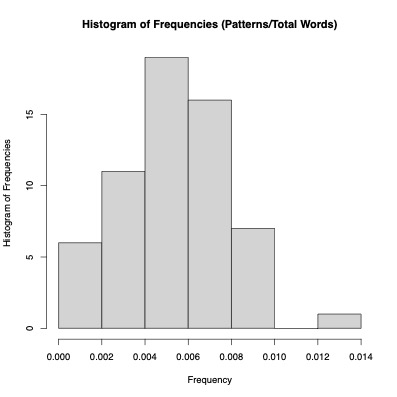
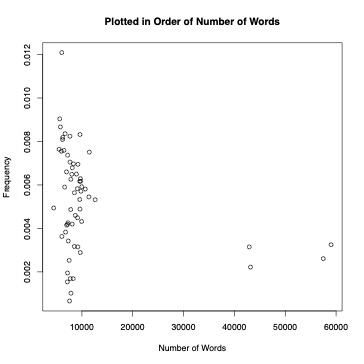
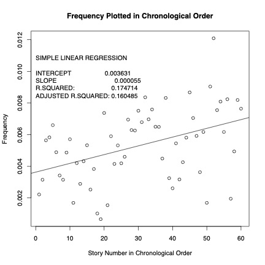
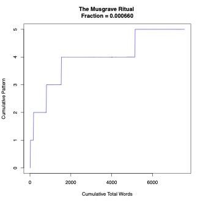
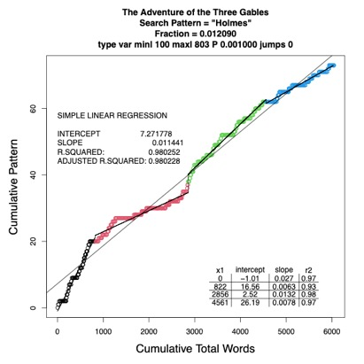
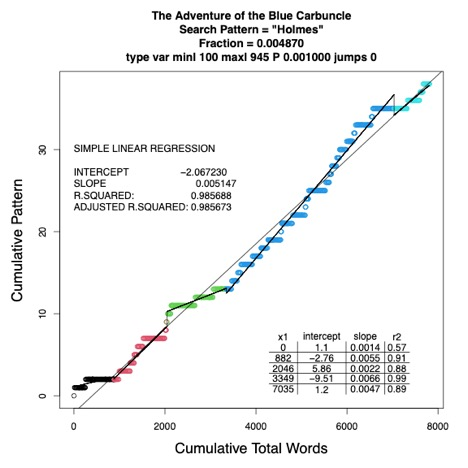

<p class=MsoNormal align=center style='text-align:center'><b style='mso-bidi-font-weight:
normal'><span style='font-size:16.0pt;font-family:"Times New Roman",serif;
color:red'>SherlockHolmes: An R Program to Analyze the Hidden Structure of Sherlock
Holmes Stories by Statistical Pattern Analysis of Concordances<o:p></o:p></span></b></p>

<p class=MsoNormal align=center style='text-align:center'><b style='mso-bidi-font-weight:
normal'><span style='font-size:16.0pt;font-family:"Times New Roman",serif'><o:p>&nbsp;</o:p></span></b></p>

<p class=MsoNormal align=center style='text-align:center'><b style='mso-bidi-font-weight:
normal'><span style='font-size:16.0pt;font-family:"Times New Roman",serif'><o:p>&nbsp;</o:p></span></b></p>

<p class=MsoNormal align=center style='text-align:center'><b style='mso-bidi-font-weight:
normal'><span style='font-size:16.0pt;font-family:"Times New Roman",serif'>Barry
Zeeberg<o:p></o:p></span></b></p>

<p class=MsoNormal align=center style='text-align:center'><b style='mso-bidi-font-weight:
normal'><span style='font-size:16.0pt;font-family:"Times New Roman",serif'>barryz2013@gmail.com<o:p></o:p></span></b></p><br>

<p class=MsoNormal align=center style='text-align:center'><i style='mso-bidi-font-style:
normal'><span style='font-size:16.0pt;font-family:"Times New Roman",serif'>Motivation<o:p></o:p></span></i></p>

<p class=MsoNormal style='text-align:justify'><span style='font-size:16.0pt;
font-family:"Times New Roman",serif'><o:p>&nbsp;</o:p></span></p>

<p class=MsoNormal style='text-align:justify'><span style='font-size:16.0pt;
font-family:"Times New Roman",serif'>Although Arthur Conan Doyle was best known
for his 60 Sherlock Holmes stories, he was a prolific writer of many other
works [</span><a href="https://en.wikipedia.org/wiki/Arthur_Conan_Doyle"><span
style='font-size:16.0pt;font-family:"Times New Roman",serif'>https://en.wikipedia.org/wiki/Arthur_Conan_Doyle</span></a><span
style='font-size:16.0pt;font-family:"Times New Roman",serif'>].<o:p></o:p></span></p>

<p class=MsoNormal style='text-align:justify'><span style='font-size:16.0pt;
font-family:"Times New Roman",serif'><o:p>&nbsp;</o:p></span></p>

<p class=MsoNormal style='text-align:justify'><span style='font-size:16.0pt;
font-family:"Times New Roman",serif'>For many decades, I have been interested
in the Sherlock Holmes stories. I have also had an interest in the Dutch artist
Johannes Vermeer, the American artist Edward Hopper, and the American bluesman
Robert Johnson. Perhaps it is just some peculiarity of my own subjective
perception, but for each of these I tend to categorize <i style='mso-bidi-font-style:
normal'>e.g.</i> “real <span class=SpellE>Vermeers</span>” <i style='mso-bidi-font-style:
normal'>versus</i> “fake <span class=SpellE>Vermeers</span>.” I do not mean
“fake” in the sense of a forgery. I mean that certain of the Vermeer paintings
strike me as representing why he is so highly-regarded, and others are more or
less “pedestrian” (as a math professor used to say about calculus proofs that
were fairly routine).<o:p></o:p></span></p>

<p class=MsoNormal style='text-align:justify'><span style='font-size:16.0pt;
font-family:"Times New Roman",serif'><o:p>&nbsp;</o:p></span></p>

<p class=MsoNormal style='text-align:justify'><span style='font-size:16.0pt;
font-family:"Times New Roman",serif'>I found that some of the Sherlock Holmes
stories seemed more like stories about something else, and Sherlock was just added
as an afterthought. Without any actual knowledge of the subject, I assumed that
Sherlock was very popular, and Conan Doyle could just use Sherlock as a “bait”
to get more readership of his “other” stories.<o:p></o:p></span></p>

<p class=MsoNormal style='text-align:justify'><span style='font-size:16.0pt;
font-family:"Times New Roman",serif'><o:p>&nbsp;</o:p></span></p>

<p class=MsoNormal style='text-align:justify'><span style='font-size:16.0pt;
font-family:"Times New Roman",serif'>It would be rather tedious to read each
story and tabulate how much of a story was really Sherlock detecting, and how
much was seemingly thousands of pages about soldiers in India or the KKK. It
occurred to me that I could write an R program to perform a concordance that
might shed some light on the matter in an objective manner. It is always
gratifying to “validate” my subjective biases using an objective procedure </span><span
style='font-size:16.0pt;font-family:Wingdings;mso-ascii-font-family:"Times New Roman";
mso-hansi-font-family:"Times New Roman";mso-bidi-font-family:"Times New Roman";
mso-char-type:symbol;mso-symbol-font-family:Wingdings'><span style='mso-char-type:
symbol;mso-symbol-font-family:Wingdings'>J</span></span><span style='font-size:
16.0pt;font-family:"Times New Roman",serif'>.<o:p></o:p></span></p>

<p class=MsoNormal style='text-align:justify'><span style='font-size:16.0pt;
font-family:"Times New Roman",serif'><o:p>&nbsp;</o:p></span></p>

<p class=MsoNormal style='text-align:justify'><span style='font-size:16.0pt;
font-family:"Times New Roman",serif'>The idea that I had was that Watson was
usually present in the stories, and he would either address Sherlock directly,
calling him “Holmes,” or he would mention “Holmes did or said such and such.” The
point is that, thanks to the presence of Watson as his chronicler, the literal
string “Holmes” could be used as a proxy for the presence or activity by
Sherlock. I am not sure that this could be done as successfully in general.<o:p></o:p></span></p>

<p class=MsoNormal style='text-align:justify'><span style='font-size:16.0pt;
font-family:"Times New Roman",serif'><o:p>&nbsp;</o:p></span></p>

<p class=MsoNormal align=center style='text-align:center'><i style='mso-bidi-font-style:
normal'><span style='font-size:16.0pt;font-family:"Times New Roman",serif'>Technical Methods</span></i><span
style='font-size:16.0pt;font-family:"Times New Roman",serif'><o:p></o:p></span></p>

<p class=MsoNormal align=center style='text-align:center'><span
style='font-size:16.0pt;font-family:"Times New Roman",serif'><o:p>&nbsp;</o:p></span></p>

<p class=MsoNormal style='text-align:justify'><span style='font-size:16.0pt;
font-family:"Times New Roman",serif'>All analyses are performed by invoking

<br>Sherlock(titles,texts,patterns,toupper,odir,minl=100,P=0.00001,verbose=FALSE)<br>

* titles is a character string containing the full path name
for a text file containing the titles of the stories
in the same order that they appear in the texts file.
If titles=="NONE", treat the entire book as one story.
* texts is a character string containing the full path name for a text file containing the full texts of all of the stories. Each story should be preceded by the title matching that given in the titles file.
* patterns is a vector containing the search patterns.
* toupper is a Boolean TRUE if the titles should be converted to upper case.
* odir is a character string containing the full path name of the output directory.
* minl is an integer param passed to dpseg::dpseg.
* P is a numeric param passed to dpseg::dpseg.
* verbose is a Boolean = FALSE to suppress optional diagnostic output to the console.

<p class=MsoNormal style='text-align:justify'><span style='font-size:16.0pt;
font-family:"Times New Roman",serif'> In two
of the figures presented below (Figures 5 and 6), I used an excellent R language package
“<span class=SpellE>dpseg</span>: Piecewise Linear Segmentation by Dynamic
Programming” by Rainer <span class=SpellE>Machne</span> and Peter Stadler. This
package implements piecewise linear regression modeling, and enables a
quantitative analysis of the results in those 2 figures. Dr. Machne kindly provided me with the source code for the plotting function, that permitted me to make several minor custom modifications.<span style='color:#666666'><o:p></o:p></span></span></h2>

<p class=MsoNormal align=center style='text-align:center'><i style='mso-bidi-font-style:
normal'><span style='font-size:16.0pt;font-family:"Times New Roman",serif'>Literary Methods</span></i><span style='font-size:16.0pt;font-family:"Times New Roman",serif'><o:p></o:p></span></p>

<p class=MsoNormal align=center style='text-align:center'><span
style='font-size:16.0pt;font-family:"Times New Roman",serif'><o:p>&nbsp;</o:p></span></p>

<o:p></o:p></span></p>

<p class=MsoNormal style='text-align:justify'><span style='font-size:16.0pt;
font-family:"Times New Roman",serif'>An excellent single text file containing
all of the stories is readily available online [</span><a
href="https://sherlock-holm.es/stories/plain-text/cano.txt"><span
style='font-size:16.0pt;font-family:"Times New Roman",serif'>https://sherlock-holm.es/stories/plain-text/cano.txt</span></a><span
style='font-size:16.0pt;font-family:"Times New Roman",serif'>]. A small amount
of manual editing was required to prepare this file for automated analysis
(mostly consisting of deleting some passages that were not part of the story,
and some chapter subtitles, <i style='mso-bidi-font-style:normal'>etc</i>.).<o:p></o:p></span></p><br>

<p class=MsoNormal style='text-align:justify'><span style='font-size:16.0pt;
font-family:"Times New Roman",serif'>The full version (contents.txt and processed_download.txt), and an abbreviated version (contents3.txt and processed_download3.txt) of the titles and text files for the Sherlock Holmes stories are provided in /inst/extdata.<o:p></o:p></span></p><br>

<p class=MsoNormal style='text-align:justify'><span style='font-size:16.0pt;
font-family:"Times New Roman",serif'>The 60 Sherlock Holmes stories are
comprised of 4 novels and 56 short stories. My recollection is that the 4 novels
are the most flagrant in not being “real” Sherlock Holmes stories, although
there were plenty of short stories for which this is also true. There was one
short story “The Adventure of the Blue Carbuncle,” which I remember had a very
high degree of participation by Holmes. I certainly expect that the analyses
described below will be consistent with these subjective impressions.<o:p></o:p></span></p>

<p class=MsoNormal style='text-align:justify'><span style='font-size:16.0pt;
font-family:"Times New Roman",serif'><o:p>&nbsp;</o:p></span></p>

<p class=MsoNormal style='text-align:justify'><span style='font-size:16.0pt;
font-family:"Times New Roman",serif'>I performed 2 types of analyses.<o:p></o:p></span></p>

<p class=MsoNormal style='text-align:justify'><span style='font-size:16.0pt;
font-family:"Times New Roman",serif'><o:p>&nbsp;</o:p></span></p>

<p class=MsoNormal style='text-align:justify'><span style='font-size:16.0pt;
font-family:"Times New Roman",serif'>The first type counted the number of times
that the search pattern “Holmes” appeared, in comparison with the total number
of words, in each story. A low ratio of “Holmes”/total could indicate a “fake”
Sherlock story.<o:p></o:p></span></p>

<p class=MsoNormal style='text-align:justify'><span style='font-size:16.0pt;
font-family:"Times New Roman",serif'><o:p>&nbsp;</o:p></span></p>

<p class=MsoNormal style='text-align:justify'><span style='font-size:16.0pt;
font-family:"Times New Roman",serif'>The second type constructed a cumulative
distribution of “Holmes” and of total words. For example, if the pattern
“Holmes” appeared twice in the first line of story, zero in the second and once
in the third, the pattern cumulative distribution would be 2 2 3. The total
words cumulative distribution would be something like <i style='mso-bidi-font-style:
normal'>e.g.</i> 10 21 29. If Holmes appeared throughout the whole story, we
would see a cumulative distribution like <i style='mso-bidi-font-style:normal'>e.g.</i>
2 4 5 8 9 . . . 20 25 32. If Holmes appeared only at the end of the story, we
would see a cumulative distribution like <i style='mso-bidi-font-style:normal'>e.g.</i>
0 0 0 0 . . . 2 4 5 8 9.<o:p></o:p></span></p>

<p class=MsoNormal style='text-align:justify'><span style='font-size:16.0pt;
font-family:"Times New Roman",serif'><o:p>&nbsp;</o:p></span></p>

<p class=MsoNormal style='text-align:justify'><span style='font-size:16.0pt;
font-family:"Times New Roman",serif'>We can see whether there is a relationship
between the results of the 2 types of analyses.<o:p></o:p></span></p>

<p class=MsoNormal style='text-align:justify'><span style='font-size:16.0pt;
font-family:"Times New Roman",serif'><o:p>&nbsp;</o:p></span></p>

<p class=MsoNormal style='text-align:justify'><span style='font-size:16.0pt;
font-family:"Times New Roman",serif'>We can also see if the there is a
“typical” result for the 2 types of analyses that hold for “most” of the
stories, with just a few stories that deviate. Or perhaps there is no “typical,”
and each story has its own characteristic analysis.<o:p></o:p></span></p>

<p class=MsoNormal style='text-align:justify'><span style='font-size:16.0pt;
font-family:"Times New Roman",serif'><o:p>&nbsp;</o:p></span></p>

<p class=MsoNormal align=center style='text-align:center'><i style='mso-bidi-font-style:
normal'><span style='font-size:16.0pt;font-family:"Times New Roman",serif'>Results
and Discussion</span></i><span style='font-size:16.0pt;font-family:"Times New Roman",serif'><o:p></o:p></span></p>

<p class=MsoNormal style='text-align:justify'><span style='font-size:16.0pt;
font-family:"Times New Roman",serif'><o:p>&nbsp;</o:p></span></p>

<p class=MsoNormal style='text-align:justify'><i style='mso-bidi-font-style:
normal'><span style='font-size:16.0pt;font-family:"Times New Roman",serif'>Basic
Word Count Analysis<o:p></o:p></span></i></p>

<p class=MsoNormal style='text-align:justify'><span style='font-size:16.0pt;
font-family:"Times New Roman",serif'>Table 1 shows that the
fraction (number of instances of “Holmes”/total number of words) covers an over
18-fold range, from a low of 0.00066 for “The Musgrave Ritual” to a high of
0.01209 for “The Adventure of the Three Gables.” This large range is consistent
with the hypothesis that Holmes is but a minor character in a number of the
stories.<o:p></o:p></span></p>

<br><p class=MsoNormal style='text-align:justify'><span style='font-size:16.0pt;
font-family:"Times New Roman",serif'>Table 1. Fraction values for
the search pattern “Holmes,” across all 60 Sherlock Holmes stories.<o:p></o:p></span></p>
<html xmlns:o="urn:schemas-microsoft-com:office:office"
xmlns:w="urn:schemas-microsoft-com:office:word"
xmlns:m="http://schemas.microsoft.com/office/2004/12/omml"
xmlns="http://www.w3.org/TR/REC-html40">

<head>
<meta http-equiv=Content-Type content="text/html; charset=utf-8">
<meta name=ProgId content=Word.Document>
<meta name=Generator content="Microsoft Word 15">
<meta name=Originator content="Microsoft Word 15">

<!--[if gte mso 9]><xml>
 <o:DocumentProperties>
  <o:Author>Barry Zeeberg</o:Author>
  <o:LastAuthor>Barry Zeeberg</o:LastAuthor>
  <o:Revision>2</o:Revision>
  <o:TotalTime>2</o:TotalTime>
  <o:Created>2023-03-10T20:56:00Z</o:Created>
  <o:LastSaved>2023-03-10T20:56:00Z</o:LastSaved>
  <o:Pages>2</o:Pages>
  <o:Words>405</o:Words>
  <o:Characters>2310</o:Characters>
  <o:Lines>19</o:Lines>
  <o:Paragraphs>5</o:Paragraphs>
  <o:CharactersWithSpaces>2710</o:CharactersWithSpaces>
  <o:Version>16.00</o:Version>
 </o:DocumentProperties>
 <o:OfficeDocumentSettings>
  <o:AllowPNG/>
 </o:OfficeDocumentSettings>
</xml><![endif]-->
<!--[if gte mso 9]><xml>
 <w:WordDocument>
  <w:SpellingState>Clean</w:SpellingState>
  <w:GrammarState>Clean</w:GrammarState>
  <w:TrackMoves>false</w:TrackMoves>
  <w:TrackFormatting/>
  <w:PunctuationKerning/>
  <w:ValidateAgainstSchemas/>
  <w:SaveIfXMLInvalid>false</w:SaveIfXMLInvalid>
  <w:IgnoreMixedContent>false</w:IgnoreMixedContent>
  <w:AlwaysShowPlaceholderText>false</w:AlwaysShowPlaceholderText>
  <w:DoNotPromoteQF/>
  <w:LidThemeOther>EN-US</w:LidThemeOther>
  <w:LidThemeAsian>X-NONE</w:LidThemeAsian>
  <w:LidThemeComplexScript>X-NONE</w:LidThemeComplexScript>
  <w:Compatibility>
   <w:BreakWrappedTables/>
   <w:SnapToGridInCell/>
   <w:WrapTextWithPunct/>
   <w:UseAsianBreakRules/>
   <w:DontGrowAutofit/>
   <w:SplitPgBreakAndParaMark/>
   <w:EnableOpenTypeKerning/>
   <w:DontFlipMirrorIndents/>
   <w:OverrideTableStyleHps/>
  </w:Compatibility>
  <m:mathPr>
   <m:mathFont m:val="Cambria Math"/>
   <m:brkBin m:val="before"/>
   <m:brkBinSub m:val="&#45;-"/>
   <m:smallFrac m:val="off"/>
   <m:dispDef/>
   <m:lMargin m:val="0"/>
   <m:rMargin m:val="0"/>
   <m:defJc m:val="centerGroup"/>
   <m:wrapIndent m:val="1440"/>
   <m:intLim m:val="subSup"/>
   <m:naryLim m:val="undOvr"/>
  </m:mathPr></w:WordDocument>
</xml><![endif]--><!--[if gte mso 9]><xml>
 <w:LatentStyles DefLockedState="false" DefUnhideWhenUsed="false"
  DefSemiHidden="false" DefQFormat="false" DefPriority="99"
  LatentStyleCount="375">
  <w:LsdException Locked="false" Priority="0" QFormat="true" Name="Normal"/>
  <w:LsdException Locked="false" Priority="9" QFormat="true" Name="heading 1"/>
  <w:LsdException Locked="false" Priority="9" SemiHidden="true"
   UnhideWhenUsed="true" QFormat="true" Name="heading 2"/>
  <w:LsdException Locked="false" Priority="9" SemiHidden="true"
   UnhideWhenUsed="true" QFormat="true" Name="heading 3"/>
  <w:LsdException Locked="false" Priority="9" SemiHidden="true"
   UnhideWhenUsed="true" QFormat="true" Name="heading 4"/>
  <w:LsdException Locked="false" Priority="9" SemiHidden="true"
   UnhideWhenUsed="true" QFormat="true" Name="heading 5"/>
  <w:LsdException Locked="false" Priority="9" SemiHidden="true"
   UnhideWhenUsed="true" QFormat="true" Name="heading 6"/>
  <w:LsdException Locked="false" Priority="9" SemiHidden="true"
   UnhideWhenUsed="true" QFormat="true" Name="heading 7"/>
  <w:LsdException Locked="false" Priority="9" SemiHidden="true"
   UnhideWhenUsed="true" QFormat="true" Name="heading 8"/>
  <w:LsdException Locked="false" Priority="9" SemiHidden="true"
   UnhideWhenUsed="true" QFormat="true" Name="heading 9"/>
  <w:LsdException Locked="false" SemiHidden="true" UnhideWhenUsed="true"
   Name="index 1"/>
  <w:LsdException Locked="false" SemiHidden="true" UnhideWhenUsed="true"
   Name="index 2"/>
  <w:LsdException Locked="false" SemiHidden="true" UnhideWhenUsed="true"
   Name="index 3"/>
  <w:LsdException Locked="false" SemiHidden="true" UnhideWhenUsed="true"
   Name="index 4"/>
  <w:LsdException Locked="false" SemiHidden="true" UnhideWhenUsed="true"
   Name="index 5"/>
  <w:LsdException Locked="false" SemiHidden="true" UnhideWhenUsed="true"
   Name="index 6"/>
  <w:LsdException Locked="false" SemiHidden="true" UnhideWhenUsed="true"
   Name="index 7"/>
  <w:LsdException Locked="false" SemiHidden="true" UnhideWhenUsed="true"
   Name="index 8"/>
  <w:LsdException Locked="false" SemiHidden="true" UnhideWhenUsed="true"
   Name="index 9"/>
  <w:LsdException Locked="false" Priority="39" SemiHidden="true"
   UnhideWhenUsed="true" Name="toc 1"/>
  <w:LsdException Locked="false" Priority="39" SemiHidden="true"
   UnhideWhenUsed="true" Name="toc 2"/>
  <w:LsdException Locked="false" Priority="39" SemiHidden="true"
   UnhideWhenUsed="true" Name="toc 3"/>
  <w:LsdException Locked="false" Priority="39" SemiHidden="true"
   UnhideWhenUsed="true" Name="toc 4"/>
  <w:LsdException Locked="false" Priority="39" SemiHidden="true"
   UnhideWhenUsed="true" Name="toc 5"/>
  <w:LsdException Locked="false" Priority="39" SemiHidden="true"
   UnhideWhenUsed="true" Name="toc 6"/>
  <w:LsdException Locked="false" Priority="39" SemiHidden="true"
   UnhideWhenUsed="true" Name="toc 7"/>
  <w:LsdException Locked="false" Priority="39" SemiHidden="true"
   UnhideWhenUsed="true" Name="toc 8"/>
  <w:LsdException Locked="false" Priority="39" SemiHidden="true"
   UnhideWhenUsed="true" Name="toc 9"/>
  <w:LsdException Locked="false" SemiHidden="true" UnhideWhenUsed="true"
   Name="Normal Indent"/>
  <w:LsdException Locked="false" SemiHidden="true" UnhideWhenUsed="true"
   Name="footnote text"/>
  <w:LsdException Locked="false" SemiHidden="true" UnhideWhenUsed="true"
   Name="annotation text"/>
  <w:LsdException Locked="false" SemiHidden="true" UnhideWhenUsed="true"
   Name="header"/>
  <w:LsdException Locked="false" SemiHidden="true" UnhideWhenUsed="true"
   Name="footer"/>
  <w:LsdException Locked="false" SemiHidden="true" UnhideWhenUsed="true"
   Name="index heading"/>
  <w:LsdException Locked="false" Priority="35" SemiHidden="true"
   UnhideWhenUsed="true" QFormat="true" Name="caption"/>
  <w:LsdException Locked="false" SemiHidden="true" UnhideWhenUsed="true"
   Name="table of figures"/>
  <w:LsdException Locked="false" SemiHidden="true" UnhideWhenUsed="true"
   Name="envelope address"/>
  <w:LsdException Locked="false" SemiHidden="true" UnhideWhenUsed="true"
   Name="envelope return"/>
  <w:LsdException Locked="false" SemiHidden="true" UnhideWhenUsed="true"
   Name="footnote reference"/>
  <w:LsdException Locked="false" SemiHidden="true" UnhideWhenUsed="true"
   Name="annotation reference"/>
  <w:LsdException Locked="false" SemiHidden="true" UnhideWhenUsed="true"
   Name="line number"/>
  <w:LsdException Locked="false" SemiHidden="true" UnhideWhenUsed="true"
   Name="page number"/>
  <w:LsdException Locked="false" SemiHidden="true" UnhideWhenUsed="true"
   Name="endnote reference"/>
  <w:LsdException Locked="false" SemiHidden="true" UnhideWhenUsed="true"
   Name="endnote text"/>
  <w:LsdException Locked="false" SemiHidden="true" UnhideWhenUsed="true"
   Name="table of authorities"/>
  <w:LsdException Locked="false" SemiHidden="true" UnhideWhenUsed="true"
   Name="macro"/>
  <w:LsdException Locked="false" SemiHidden="true" UnhideWhenUsed="true"
   Name="toa heading"/>
  <w:LsdException Locked="false" SemiHidden="true" UnhideWhenUsed="true"
   Name="List"/>
  <w:LsdException Locked="false" SemiHidden="true" UnhideWhenUsed="true"
   Name="List Bullet"/>
  <w:LsdException Locked="false" SemiHidden="true" UnhideWhenUsed="true"
   Name="List Number"/>
  <w:LsdException Locked="false" SemiHidden="true" UnhideWhenUsed="true"
   Name="List 2"/>
  <w:LsdException Locked="false" SemiHidden="true" UnhideWhenUsed="true"
   Name="List 3"/>
  <w:LsdException Locked="false" SemiHidden="true" UnhideWhenUsed="true"
   Name="List 4"/>
  <w:LsdException Locked="false" SemiHidden="true" UnhideWhenUsed="true"
   Name="List 5"/>
  <w:LsdException Locked="false" SemiHidden="true" UnhideWhenUsed="true"
   Name="List Bullet 2"/>
  <w:LsdException Locked="false" SemiHidden="true" UnhideWhenUsed="true"
   Name="List Bullet 3"/>
  <w:LsdException Locked="false" SemiHidden="true" UnhideWhenUsed="true"
   Name="List Bullet 4"/>
  <w:LsdException Locked="false" SemiHidden="true" UnhideWhenUsed="true"
   Name="List Bullet 5"/>
  <w:LsdException Locked="false" SemiHidden="true" UnhideWhenUsed="true"
   Name="List Number 2"/>
  <w:LsdException Locked="false" SemiHidden="true" UnhideWhenUsed="true"
   Name="List Number 3"/>
  <w:LsdException Locked="false" SemiHidden="true" UnhideWhenUsed="true"
   Name="List Number 4"/>
  <w:LsdException Locked="false" SemiHidden="true" UnhideWhenUsed="true"
   Name="List Number 5"/>
  <w:LsdException Locked="false" Priority="10" QFormat="true" Name="Title"/>
  <w:LsdException Locked="false" SemiHidden="true" UnhideWhenUsed="true"
   Name="Closing"/>
  <w:LsdException Locked="false" SemiHidden="true" UnhideWhenUsed="true"
   Name="Signature"/>
  <w:LsdException Locked="false" Priority="1" SemiHidden="true"
   UnhideWhenUsed="true" Name="Default Paragraph Font"/>
  <w:LsdException Locked="false" SemiHidden="true" UnhideWhenUsed="true"
   Name="Body Text"/>
  <w:LsdException Locked="false" SemiHidden="true" UnhideWhenUsed="true"
   Name="Body Text Indent"/>
  <w:LsdException Locked="false" SemiHidden="true" UnhideWhenUsed="true"
   Name="List Continue"/>
  <w:LsdException Locked="false" SemiHidden="true" UnhideWhenUsed="true"
   Name="List Continue 2"/>
  <w:LsdException Locked="false" SemiHidden="true" UnhideWhenUsed="true"
   Name="List Continue 3"/>
  <w:LsdException Locked="false" SemiHidden="true" UnhideWhenUsed="true"
   Name="List Continue 4"/>
  <w:LsdException Locked="false" SemiHidden="true" UnhideWhenUsed="true"
   Name="List Continue 5"/>
  <w:LsdException Locked="false" SemiHidden="true" UnhideWhenUsed="true"
   Name="Message Header"/>
  <w:LsdException Locked="false" Priority="11" QFormat="true" Name="Subtitle"/>
  <w:LsdException Locked="false" SemiHidden="true" UnhideWhenUsed="true"
   Name="Salutation"/>
  <w:LsdException Locked="false" SemiHidden="true" UnhideWhenUsed="true"
   Name="Date"/>
  <w:LsdException Locked="false" SemiHidden="true" UnhideWhenUsed="true"
   Name="Body Text First Indent"/>
  <w:LsdException Locked="false" SemiHidden="true" UnhideWhenUsed="true"
   Name="Body Text First Indent 2"/>
  <w:LsdException Locked="false" SemiHidden="true" UnhideWhenUsed="true"
   Name="Note Heading"/>
  <w:LsdException Locked="false" SemiHidden="true" UnhideWhenUsed="true"
   Name="Body Text 2"/>
  <w:LsdException Locked="false" SemiHidden="true" UnhideWhenUsed="true"
   Name="Body Text 3"/>
  <w:LsdException Locked="false" SemiHidden="true" UnhideWhenUsed="true"
   Name="Body Text Indent 2"/>
  <w:LsdException Locked="false" SemiHidden="true" UnhideWhenUsed="true"
   Name="Body Text Indent 3"/>
  <w:LsdException Locked="false" SemiHidden="true" UnhideWhenUsed="true"
   Name="Block Text"/>
  <w:LsdException Locked="false" SemiHidden="true" UnhideWhenUsed="true"
   Name="Hyperlink"/>
  <w:LsdException Locked="false" SemiHidden="true" UnhideWhenUsed="true"
   Name="FollowedHyperlink"/>
  <w:LsdException Locked="false" Priority="22" QFormat="true" Name="Strong"/>
  <w:LsdException Locked="false" Priority="20" QFormat="true" Name="Emphasis"/>
  <w:LsdException Locked="false" SemiHidden="true" UnhideWhenUsed="true"
   Name="Document Map"/>
  <w:LsdException Locked="false" SemiHidden="true" UnhideWhenUsed="true"
   Name="Plain Text"/>
  <w:LsdException Locked="false" SemiHidden="true" UnhideWhenUsed="true"
   Name="E-mail Signature"/>
  <w:LsdException Locked="false" SemiHidden="true" UnhideWhenUsed="true"
   Name="HTML Top of Form"/>
  <w:LsdException Locked="false" SemiHidden="true" UnhideWhenUsed="true"
   Name="HTML Bottom of Form"/>
  <w:LsdException Locked="false" SemiHidden="true" UnhideWhenUsed="true"
   Name="Normal (Web)"/>
  <w:LsdException Locked="false" SemiHidden="true" UnhideWhenUsed="true"
   Name="HTML Acronym"/>
  <w:LsdException Locked="false" SemiHidden="true" UnhideWhenUsed="true"
   Name="HTML Address"/>
  <w:LsdException Locked="false" SemiHidden="true" UnhideWhenUsed="true"
   Name="HTML Cite"/>
  <w:LsdException Locked="false" SemiHidden="true" UnhideWhenUsed="true"
   Name="HTML Code"/>
  <w:LsdException Locked="false" SemiHidden="true" UnhideWhenUsed="true"
   Name="HTML Definition"/>
  <w:LsdException Locked="false" SemiHidden="true" UnhideWhenUsed="true"
   Name="HTML Keyboard"/>
  <w:LsdException Locked="false" SemiHidden="true" UnhideWhenUsed="true"
   Name="HTML Preformatted"/>
  <w:LsdException Locked="false" SemiHidden="true" UnhideWhenUsed="true"
   Name="HTML Sample"/>
  <w:LsdException Locked="false" SemiHidden="true" UnhideWhenUsed="true"
   Name="HTML Typewriter"/>
  <w:LsdException Locked="false" SemiHidden="true" UnhideWhenUsed="true"
   Name="HTML Variable"/>
  <w:LsdException Locked="false" SemiHidden="true" UnhideWhenUsed="true"
   Name="Normal Table"/>
  <w:LsdException Locked="false" SemiHidden="true" UnhideWhenUsed="true"
   Name="annotation subject"/>
  <w:LsdException Locked="false" SemiHidden="true" UnhideWhenUsed="true"
   Name="No List"/>
  <w:LsdException Locked="false" SemiHidden="true" UnhideWhenUsed="true"
   Name="Outline List 1"/>
  <w:LsdException Locked="false" SemiHidden="true" UnhideWhenUsed="true"
   Name="Outline List 2"/>
  <w:LsdException Locked="false" SemiHidden="true" UnhideWhenUsed="true"
   Name="Outline List 3"/>
  <w:LsdException Locked="false" SemiHidden="true" UnhideWhenUsed="true"
   Name="Table Simple 1"/>
  <w:LsdException Locked="false" SemiHidden="true" UnhideWhenUsed="true"
   Name="Table Simple 2"/>
  <w:LsdException Locked="false" SemiHidden="true" UnhideWhenUsed="true"
   Name="Table Simple 3"/>
  <w:LsdException Locked="false" SemiHidden="true" UnhideWhenUsed="true"
   Name="Table Classic 1"/>
  <w:LsdException Locked="false" SemiHidden="true" UnhideWhenUsed="true"
   Name="Table Classic 2"/>
  <w:LsdException Locked="false" SemiHidden="true" UnhideWhenUsed="true"
   Name="Table Classic 3"/>
  <w:LsdException Locked="false" SemiHidden="true" UnhideWhenUsed="true"
   Name="Table Classic 4"/>
  <w:LsdException Locked="false" SemiHidden="true" UnhideWhenUsed="true"
   Name="Table Colorful 1"/>
  <w:LsdException Locked="false" SemiHidden="true" UnhideWhenUsed="true"
   Name="Table Colorful 2"/>
  <w:LsdException Locked="false" SemiHidden="true" UnhideWhenUsed="true"
   Name="Table Colorful 3"/>
  <w:LsdException Locked="false" SemiHidden="true" UnhideWhenUsed="true"
   Name="Table Columns 1"/>
  <w:LsdException Locked="false" SemiHidden="true" UnhideWhenUsed="true"
   Name="Table Columns 2"/>
  <w:LsdException Locked="false" SemiHidden="true" UnhideWhenUsed="true"
   Name="Table Columns 3"/>
  <w:LsdException Locked="false" SemiHidden="true" UnhideWhenUsed="true"
   Name="Table Columns 4"/>
  <w:LsdException Locked="false" SemiHidden="true" UnhideWhenUsed="true"
   Name="Table Columns 5"/>
  <w:LsdException Locked="false" SemiHidden="true" UnhideWhenUsed="true"
   Name="Table Grid 1"/>
  <w:LsdException Locked="false" SemiHidden="true" UnhideWhenUsed="true"
   Name="Table Grid 2"/>
  <w:LsdException Locked="false" SemiHidden="true" UnhideWhenUsed="true"
   Name="Table Grid 3"/>
  <w:LsdException Locked="false" SemiHidden="true" UnhideWhenUsed="true"
   Name="Table Grid 4"/>
  <w:LsdException Locked="false" SemiHidden="true" UnhideWhenUsed="true"
   Name="Table Grid 5"/>
  <w:LsdException Locked="false" SemiHidden="true" UnhideWhenUsed="true"
   Name="Table Grid 6"/>
  <w:LsdException Locked="false" SemiHidden="true" UnhideWhenUsed="true"
   Name="Table Grid 7"/>
  <w:LsdException Locked="false" SemiHidden="true" UnhideWhenUsed="true"
   Name="Table Grid 8"/>
  <w:LsdException Locked="false" SemiHidden="true" UnhideWhenUsed="true"
   Name="Table List 1"/>
  <w:LsdException Locked="false" SemiHidden="true" UnhideWhenUsed="true"
   Name="Table List 2"/>
  <w:LsdException Locked="false" SemiHidden="true" UnhideWhenUsed="true"
   Name="Table List 3"/>
  <w:LsdException Locked="false" SemiHidden="true" UnhideWhenUsed="true"
   Name="Table List 4"/>
  <w:LsdException Locked="false" SemiHidden="true" UnhideWhenUsed="true"
   Name="Table List 5"/>
  <w:LsdException Locked="false" SemiHidden="true" UnhideWhenUsed="true"
   Name="Table List 6"/>
  <w:LsdException Locked="false" SemiHidden="true" UnhideWhenUsed="true"
   Name="Table List 7"/>
  <w:LsdException Locked="false" SemiHidden="true" UnhideWhenUsed="true"
   Name="Table List 8"/>
  <w:LsdException Locked="false" SemiHidden="true" UnhideWhenUsed="true"
   Name="Table 3D effects 1"/>
  <w:LsdException Locked="false" SemiHidden="true" UnhideWhenUsed="true"
   Name="Table 3D effects 2"/>
  <w:LsdException Locked="false" SemiHidden="true" UnhideWhenUsed="true"
   Name="Table 3D effects 3"/>
  <w:LsdException Locked="false" SemiHidden="true" UnhideWhenUsed="true"
   Name="Table Contemporary"/>
  <w:LsdException Locked="false" SemiHidden="true" UnhideWhenUsed="true"
   Name="Table Elegant"/>
  <w:LsdException Locked="false" SemiHidden="true" UnhideWhenUsed="true"
   Name="Table Professional"/>
  <w:LsdException Locked="false" SemiHidden="true" UnhideWhenUsed="true"
   Name="Table Subtle 1"/>
  <w:LsdException Locked="false" SemiHidden="true" UnhideWhenUsed="true"
   Name="Table Subtle 2"/>
  <w:LsdException Locked="false" SemiHidden="true" UnhideWhenUsed="true"
   Name="Table Web 1"/>
  <w:LsdException Locked="false" SemiHidden="true" UnhideWhenUsed="true"
   Name="Table Web 2"/>
  <w:LsdException Locked="false" SemiHidden="true" UnhideWhenUsed="true"
   Name="Table Web 3"/>
  <w:LsdException Locked="false" SemiHidden="true" UnhideWhenUsed="true"
   Name="Balloon Text"/>
  <w:LsdException Locked="false" Priority="39" Name="Table Grid"/>
  <w:LsdException Locked="false" SemiHidden="true" UnhideWhenUsed="true"
   Name="Table Theme"/>
  <w:LsdException Locked="false" SemiHidden="true" Name="Placeholder Text"/>
  <w:LsdException Locked="false" Priority="1" QFormat="true" Name="No Spacing"/>
  <w:LsdException Locked="false" Priority="60" Name="Light Shading"/>
  <w:LsdException Locked="false" Priority="61" Name="Light List"/>
  <w:LsdException Locked="false" Priority="62" Name="Light Grid"/>
  <w:LsdException Locked="false" Priority="63" Name="Medium Shading 1"/>
  <w:LsdException Locked="false" Priority="64" Name="Medium Shading 2"/>
  <w:LsdException Locked="false" Priority="65" Name="Medium List 1"/>
  <w:LsdException Locked="false" Priority="66" Name="Medium List 2"/>
  <w:LsdException Locked="false" Priority="67" Name="Medium Grid 1"/>
  <w:LsdException Locked="false" Priority="68" Name="Medium Grid 2"/>
  <w:LsdException Locked="false" Priority="69" Name="Medium Grid 3"/>
  <w:LsdException Locked="false" Priority="70" Name="Dark List"/>
  <w:LsdException Locked="false" Priority="71" Name="Colorful Shading"/>
  <w:LsdException Locked="false" Priority="72" Name="Colorful List"/>
  <w:LsdException Locked="false" Priority="73" Name="Colorful Grid"/>
  <w:LsdException Locked="false" Priority="60" Name="Light Shading Accent 1"/>
  <w:LsdException Locked="false" Priority="61" Name="Light List Accent 1"/>
  <w:LsdException Locked="false" Priority="62" Name="Light Grid Accent 1"/>
  <w:LsdException Locked="false" Priority="63" Name="Medium Shading 1 Accent 1"/>
  <w:LsdException Locked="false" Priority="64" Name="Medium Shading 2 Accent 1"/>
  <w:LsdException Locked="false" Priority="65" Name="Medium List 1 Accent 1"/>
  <w:LsdException Locked="false" SemiHidden="true" Name="Revision"/>
  <w:LsdException Locked="false" Priority="34" QFormat="true"
   Name="List Paragraph"/>
  <w:LsdException Locked="false" Priority="29" QFormat="true" Name="Quote"/>
  <w:LsdException Locked="false" Priority="30" QFormat="true"
   Name="Intense Quote"/>
  <w:LsdException Locked="false" Priority="66" Name="Medium List 2 Accent 1"/>
  <w:LsdException Locked="false" Priority="67" Name="Medium Grid 1 Accent 1"/>
  <w:LsdException Locked="false" Priority="68" Name="Medium Grid 2 Accent 1"/>
  <w:LsdException Locked="false" Priority="69" Name="Medium Grid 3 Accent 1"/>
  <w:LsdException Locked="false" Priority="70" Name="Dark List Accent 1"/>
  <w:LsdException Locked="false" Priority="71" Name="Colorful Shading Accent 1"/>
  <w:LsdException Locked="false" Priority="72" Name="Colorful List Accent 1"/>
  <w:LsdException Locked="false" Priority="73" Name="Colorful Grid Accent 1"/>
  <w:LsdException Locked="false" Priority="60" Name="Light Shading Accent 2"/>
  <w:LsdException Locked="false" Priority="61" Name="Light List Accent 2"/>
  <w:LsdException Locked="false" Priority="62" Name="Light Grid Accent 2"/>
  <w:LsdException Locked="false" Priority="63" Name="Medium Shading 1 Accent 2"/>
  <w:LsdException Locked="false" Priority="64" Name="Medium Shading 2 Accent 2"/>
  <w:LsdException Locked="false" Priority="65" Name="Medium List 1 Accent 2"/>
  <w:LsdException Locked="false" Priority="66" Name="Medium List 2 Accent 2"/>
  <w:LsdException Locked="false" Priority="67" Name="Medium Grid 1 Accent 2"/>
  <w:LsdException Locked="false" Priority="68" Name="Medium Grid 2 Accent 2"/>
  <w:LsdException Locked="false" Priority="69" Name="Medium Grid 3 Accent 2"/>
  <w:LsdException Locked="false" Priority="70" Name="Dark List Accent 2"/>
  <w:LsdException Locked="false" Priority="71" Name="Colorful Shading Accent 2"/>
  <w:LsdException Locked="false" Priority="72" Name="Colorful List Accent 2"/>
  <w:LsdException Locked="false" Priority="73" Name="Colorful Grid Accent 2"/>
  <w:LsdException Locked="false" Priority="60" Name="Light Shading Accent 3"/>
  <w:LsdException Locked="false" Priority="61" Name="Light List Accent 3"/>
  <w:LsdException Locked="false" Priority="62" Name="Light Grid Accent 3"/>
  <w:LsdException Locked="false" Priority="63" Name="Medium Shading 1 Accent 3"/>
  <w:LsdException Locked="false" Priority="64" Name="Medium Shading 2 Accent 3"/>
  <w:LsdException Locked="false" Priority="65" Name="Medium List 1 Accent 3"/>
  <w:LsdException Locked="false" Priority="66" Name="Medium List 2 Accent 3"/>
  <w:LsdException Locked="false" Priority="67" Name="Medium Grid 1 Accent 3"/>
  <w:LsdException Locked="false" Priority="68" Name="Medium Grid 2 Accent 3"/>
  <w:LsdException Locked="false" Priority="69" Name="Medium Grid 3 Accent 3"/>
  <w:LsdException Locked="false" Priority="70" Name="Dark List Accent 3"/>
  <w:LsdException Locked="false" Priority="71" Name="Colorful Shading Accent 3"/>
  <w:LsdException Locked="false" Priority="72" Name="Colorful List Accent 3"/>
  <w:LsdException Locked="false" Priority="73" Name="Colorful Grid Accent 3"/>
  <w:LsdException Locked="false" Priority="60" Name="Light Shading Accent 4"/>
  <w:LsdException Locked="false" Priority="61" Name="Light List Accent 4"/>
  <w:LsdException Locked="false" Priority="62" Name="Light Grid Accent 4"/>
  <w:LsdException Locked="false" Priority="63" Name="Medium Shading 1 Accent 4"/>
  <w:LsdException Locked="false" Priority="64" Name="Medium Shading 2 Accent 4"/>
  <w:LsdException Locked="false" Priority="65" Name="Medium List 1 Accent 4"/>
  <w:LsdException Locked="false" Priority="66" Name="Medium List 2 Accent 4"/>
  <w:LsdException Locked="false" Priority="67" Name="Medium Grid 1 Accent 4"/>
  <w:LsdException Locked="false" Priority="68" Name="Medium Grid 2 Accent 4"/>
  <w:LsdException Locked="false" Priority="69" Name="Medium Grid 3 Accent 4"/>
  <w:LsdException Locked="false" Priority="70" Name="Dark List Accent 4"/>
  <w:LsdException Locked="false" Priority="71" Name="Colorful Shading Accent 4"/>
  <w:LsdException Locked="false" Priority="72" Name="Colorful List Accent 4"/>
  <w:LsdException Locked="false" Priority="73" Name="Colorful Grid Accent 4"/>
  <w:LsdException Locked="false" Priority="60" Name="Light Shading Accent 5"/>
  <w:LsdException Locked="false" Priority="61" Name="Light List Accent 5"/>
  <w:LsdException Locked="false" Priority="62" Name="Light Grid Accent 5"/>
  <w:LsdException Locked="false" Priority="63" Name="Medium Shading 1 Accent 5"/>
  <w:LsdException Locked="false" Priority="64" Name="Medium Shading 2 Accent 5"/>
  <w:LsdException Locked="false" Priority="65" Name="Medium List 1 Accent 5"/>
  <w:LsdException Locked="false" Priority="66" Name="Medium List 2 Accent 5"/>
  <w:LsdException Locked="false" Priority="67" Name="Medium Grid 1 Accent 5"/>
  <w:LsdException Locked="false" Priority="68" Name="Medium Grid 2 Accent 5"/>
  <w:LsdException Locked="false" Priority="69" Name="Medium Grid 3 Accent 5"/>
  <w:LsdException Locked="false" Priority="70" Name="Dark List Accent 5"/>
  <w:LsdException Locked="false" Priority="71" Name="Colorful Shading Accent 5"/>
  <w:LsdException Locked="false" Priority="72" Name="Colorful List Accent 5"/>
  <w:LsdException Locked="false" Priority="73" Name="Colorful Grid Accent 5"/>
  <w:LsdException Locked="false" Priority="60" Name="Light Shading Accent 6"/>
  <w:LsdException Locked="false" Priority="61" Name="Light List Accent 6"/>
  <w:LsdException Locked="false" Priority="62" Name="Light Grid Accent 6"/>
  <w:LsdException Locked="false" Priority="63" Name="Medium Shading 1 Accent 6"/>
  <w:LsdException Locked="false" Priority="64" Name="Medium Shading 2 Accent 6"/>
  <w:LsdException Locked="false" Priority="65" Name="Medium List 1 Accent 6"/>
  <w:LsdException Locked="false" Priority="66" Name="Medium List 2 Accent 6"/>
  <w:LsdException Locked="false" Priority="67" Name="Medium Grid 1 Accent 6"/>
  <w:LsdException Locked="false" Priority="68" Name="Medium Grid 2 Accent 6"/>
  <w:LsdException Locked="false" Priority="69" Name="Medium Grid 3 Accent 6"/>
  <w:LsdException Locked="false" Priority="70" Name="Dark List Accent 6"/>
  <w:LsdException Locked="false" Priority="71" Name="Colorful Shading Accent 6"/>
  <w:LsdException Locked="false" Priority="72" Name="Colorful List Accent 6"/>
  <w:LsdException Locked="false" Priority="73" Name="Colorful Grid Accent 6"/>
  <w:LsdException Locked="false" Priority="19" QFormat="true"
   Name="Subtle Emphasis"/>
  <w:LsdException Locked="false" Priority="21" QFormat="true"
   Name="Intense Emphasis"/>
  <w:LsdException Locked="false" Priority="31" QFormat="true"
   Name="Subtle Reference"/>
  <w:LsdException Locked="false" Priority="32" QFormat="true"
   Name="Intense Reference"/>
  <w:LsdException Locked="false" Priority="33" QFormat="true" Name="Book Title"/>
  <w:LsdException Locked="false" Priority="37" SemiHidden="true"
   UnhideWhenUsed="true" Name="Bibliography"/>
  <w:LsdException Locked="false" Priority="39" SemiHidden="true"
   UnhideWhenUsed="true" QFormat="true" Name="TOC Heading"/>
  <w:LsdException Locked="false" Priority="41" Name="Plain Table 1"/>
  <w:LsdException Locked="false" Priority="42" Name="Plain Table 2"/>
  <w:LsdException Locked="false" Priority="43" Name="Plain Table 3"/>
  <w:LsdException Locked="false" Priority="44" Name="Plain Table 4"/>
  <w:LsdException Locked="false" Priority="45" Name="Plain Table 5"/>
  <w:LsdException Locked="false" Priority="40" Name="Grid Table Light"/>
  <w:LsdException Locked="false" Priority="46" Name="Grid Table 1 Light"/>
  <w:LsdException Locked="false" Priority="47" Name="Grid Table 2"/>
  <w:LsdException Locked="false" Priority="48" Name="Grid Table 3"/>
  <w:LsdException Locked="false" Priority="49" Name="Grid Table 4"/>
  <w:LsdException Locked="false" Priority="50" Name="Grid Table 5 Dark"/>
  <w:LsdException Locked="false" Priority="51" Name="Grid Table 6 Colorful"/>
  <w:LsdException Locked="false" Priority="52" Name="Grid Table 7 Colorful"/>
  <w:LsdException Locked="false" Priority="46"
   Name="Grid Table 1 Light Accent 1"/>
  <w:LsdException Locked="false" Priority="47" Name="Grid Table 2 Accent 1"/>
  <w:LsdException Locked="false" Priority="48" Name="Grid Table 3 Accent 1"/>
  <w:LsdException Locked="false" Priority="49" Name="Grid Table 4 Accent 1"/>
  <w:LsdException Locked="false" Priority="50" Name="Grid Table 5 Dark Accent 1"/>
  <w:LsdException Locked="false" Priority="51"
   Name="Grid Table 6 Colorful Accent 1"/>
  <w:LsdException Locked="false" Priority="52"
   Name="Grid Table 7 Colorful Accent 1"/>
  <w:LsdException Locked="false" Priority="46"
   Name="Grid Table 1 Light Accent 2"/>
  <w:LsdException Locked="false" Priority="47" Name="Grid Table 2 Accent 2"/>
  <w:LsdException Locked="false" Priority="48" Name="Grid Table 3 Accent 2"/>
  <w:LsdException Locked="false" Priority="49" Name="Grid Table 4 Accent 2"/>
  <w:LsdException Locked="false" Priority="50" Name="Grid Table 5 Dark Accent 2"/>
  <w:LsdException Locked="false" Priority="51"
   Name="Grid Table 6 Colorful Accent 2"/>
  <w:LsdException Locked="false" Priority="52"
   Name="Grid Table 7 Colorful Accent 2"/>
  <w:LsdException Locked="false" Priority="46"
   Name="Grid Table 1 Light Accent 3"/>
  <w:LsdException Locked="false" Priority="47" Name="Grid Table 2 Accent 3"/>
  <w:LsdException Locked="false" Priority="48" Name="Grid Table 3 Accent 3"/>
  <w:LsdException Locked="false" Priority="49" Name="Grid Table 4 Accent 3"/>
  <w:LsdException Locked="false" Priority="50" Name="Grid Table 5 Dark Accent 3"/>
  <w:LsdException Locked="false" Priority="51"
   Name="Grid Table 6 Colorful Accent 3"/>
  <w:LsdException Locked="false" Priority="52"
   Name="Grid Table 7 Colorful Accent 3"/>
  <w:LsdException Locked="false" Priority="46"
   Name="Grid Table 1 Light Accent 4"/>
  <w:LsdException Locked="false" Priority="47" Name="Grid Table 2 Accent 4"/>
  <w:LsdException Locked="false" Priority="48" Name="Grid Table 3 Accent 4"/>
  <w:LsdException Locked="false" Priority="49" Name="Grid Table 4 Accent 4"/>
  <w:LsdException Locked="false" Priority="50" Name="Grid Table 5 Dark Accent 4"/>
  <w:LsdException Locked="false" Priority="51"
   Name="Grid Table 6 Colorful Accent 4"/>
  <w:LsdException Locked="false" Priority="52"
   Name="Grid Table 7 Colorful Accent 4"/>
  <w:LsdException Locked="false" Priority="46"
   Name="Grid Table 1 Light Accent 5"/>
  <w:LsdException Locked="false" Priority="47" Name="Grid Table 2 Accent 5"/>
  <w:LsdException Locked="false" Priority="48" Name="Grid Table 3 Accent 5"/>
  <w:LsdException Locked="false" Priority="49" Name="Grid Table 4 Accent 5"/>
  <w:LsdException Locked="false" Priority="50" Name="Grid Table 5 Dark Accent 5"/>
  <w:LsdException Locked="false" Priority="51"
   Name="Grid Table 6 Colorful Accent 5"/>
  <w:LsdException Locked="false" Priority="52"
   Name="Grid Table 7 Colorful Accent 5"/>
  <w:LsdException Locked="false" Priority="46"
   Name="Grid Table 1 Light Accent 6"/>
  <w:LsdException Locked="false" Priority="47" Name="Grid Table 2 Accent 6"/>
  <w:LsdException Locked="false" Priority="48" Name="Grid Table 3 Accent 6"/>
  <w:LsdException Locked="false" Priority="49" Name="Grid Table 4 Accent 6"/>
  <w:LsdException Locked="false" Priority="50" Name="Grid Table 5 Dark Accent 6"/>
  <w:LsdException Locked="false" Priority="51"
   Name="Grid Table 6 Colorful Accent 6"/>
  <w:LsdException Locked="false" Priority="52"
   Name="Grid Table 7 Colorful Accent 6"/>
  <w:LsdException Locked="false" Priority="46" Name="List Table 1 Light"/>
  <w:LsdException Locked="false" Priority="47" Name="List Table 2"/>
  <w:LsdException Locked="false" Priority="48" Name="List Table 3"/>
  <w:LsdException Locked="false" Priority="49" Name="List Table 4"/>
  <w:LsdException Locked="false" Priority="50" Name="List Table 5 Dark"/>
  <w:LsdException Locked="false" Priority="51" Name="List Table 6 Colorful"/>
  <w:LsdException Locked="false" Priority="52" Name="List Table 7 Colorful"/>
  <w:LsdException Locked="false" Priority="46"
   Name="List Table 1 Light Accent 1"/>
  <w:LsdException Locked="false" Priority="47" Name="List Table 2 Accent 1"/>
  <w:LsdException Locked="false" Priority="48" Name="List Table 3 Accent 1"/>
  <w:LsdException Locked="false" Priority="49" Name="List Table 4 Accent 1"/>
  <w:LsdException Locked="false" Priority="50" Name="List Table 5 Dark Accent 1"/>
  <w:LsdException Locked="false" Priority="51"
   Name="List Table 6 Colorful Accent 1"/>
  <w:LsdException Locked="false" Priority="52"
   Name="List Table 7 Colorful Accent 1"/>
  <w:LsdException Locked="false" Priority="46"
   Name="List Table 1 Light Accent 2"/>
  <w:LsdException Locked="false" Priority="47" Name="List Table 2 Accent 2"/>
  <w:LsdException Locked="false" Priority="48" Name="List Table 3 Accent 2"/>
  <w:LsdException Locked="false" Priority="49" Name="List Table 4 Accent 2"/>
  <w:LsdException Locked="false" Priority="50" Name="List Table 5 Dark Accent 2"/>
  <w:LsdException Locked="false" Priority="51"
   Name="List Table 6 Colorful Accent 2"/>
  <w:LsdException Locked="false" Priority="52"
   Name="List Table 7 Colorful Accent 2"/>
  <w:LsdException Locked="false" Priority="46"
   Name="List Table 1 Light Accent 3"/>
  <w:LsdException Locked="false" Priority="47" Name="List Table 2 Accent 3"/>
  <w:LsdException Locked="false" Priority="48" Name="List Table 3 Accent 3"/>
  <w:LsdException Locked="false" Priority="49" Name="List Table 4 Accent 3"/>
  <w:LsdException Locked="false" Priority="50" Name="List Table 5 Dark Accent 3"/>
  <w:LsdException Locked="false" Priority="51"
   Name="List Table 6 Colorful Accent 3"/>
  <w:LsdException Locked="false" Priority="52"
   Name="List Table 7 Colorful Accent 3"/>
  <w:LsdException Locked="false" Priority="46"
   Name="List Table 1 Light Accent 4"/>
  <w:LsdException Locked="false" Priority="47" Name="List Table 2 Accent 4"/>
  <w:LsdException Locked="false" Priority="48" Name="List Table 3 Accent 4"/>
  <w:LsdException Locked="false" Priority="49" Name="List Table 4 Accent 4"/>
  <w:LsdException Locked="false" Priority="50" Name="List Table 5 Dark Accent 4"/>
  <w:LsdException Locked="false" Priority="51"
   Name="List Table 6 Colorful Accent 4"/>
  <w:LsdException Locked="false" Priority="52"
   Name="List Table 7 Colorful Accent 4"/>
  <w:LsdException Locked="false" Priority="46"
   Name="List Table 1 Light Accent 5"/>
  <w:LsdException Locked="false" Priority="47" Name="List Table 2 Accent 5"/>
  <w:LsdException Locked="false" Priority="48" Name="List Table 3 Accent 5"/>
  <w:LsdException Locked="false" Priority="49" Name="List Table 4 Accent 5"/>
  <w:LsdException Locked="false" Priority="50" Name="List Table 5 Dark Accent 5"/>
  <w:LsdException Locked="false" Priority="51"
   Name="List Table 6 Colorful Accent 5"/>
  <w:LsdException Locked="false" Priority="52"
   Name="List Table 7 Colorful Accent 5"/>
  <w:LsdException Locked="false" Priority="46"
   Name="List Table 1 Light Accent 6"/>
  <w:LsdException Locked="false" Priority="47" Name="List Table 2 Accent 6"/>
  <w:LsdException Locked="false" Priority="48" Name="List Table 3 Accent 6"/>
  <w:LsdException Locked="false" Priority="49" Name="List Table 4 Accent 6"/>
  <w:LsdException Locked="false" Priority="50" Name="List Table 5 Dark Accent 6"/>
  <w:LsdException Locked="false" Priority="51"
   Name="List Table 6 Colorful Accent 6"/>
  <w:LsdException Locked="false" Priority="52"
   Name="List Table 7 Colorful Accent 6"/>
  <w:LsdException Locked="false" SemiHidden="true" UnhideWhenUsed="true"
   Name="Mention"/>
  <w:LsdException Locked="false" SemiHidden="true" UnhideWhenUsed="true"
   Name="Smart Hyperlink"/>
 </w:LatentStyles>
</xml><![endif]-->
<style>
<!--
 /* Font Definitions */
 @font-face
	{font-family:"Cambria Math";
	panose-1:2 4 5 3 5 4 6 3 2 4;
	mso-font-charset:0;
	mso-generic-font-family:roman;
	mso-font-pitch:variable;
	mso-font-signature:-536870145 1107305727 0 0 415 0;}
@font-face
	{font-family:Calibri;
	panose-1:2 15 5 2 2 2 4 3 2 4;
	mso-font-charset:0;
	mso-generic-font-family:swiss;
	mso-font-pitch:variable;
	mso-font-signature:-536859905 -1073732485 9 0 511 0;}
 /* Style Definitions */
 p.MsoNormal, li.MsoNormal, div.MsoNormal
	{mso-style-unhide:no;
	mso-style-qformat:yes;
	mso-style-parent:"";
	margin:0in;
	margin-bottom:.0001pt;
	mso-pagination:widow-orphan;
	font-size:12.0pt;
	font-family:"Calibri",sans-serif;
	mso-ascii-font-family:Calibri;
	mso-ascii-theme-font:minor-latin;
	mso-fareast-font-family:Calibri;
	mso-fareast-theme-font:minor-latin;
	mso-hansi-font-family:Calibri;
	mso-hansi-theme-font:minor-latin;
	mso-bidi-font-family:"Times New Roman";
	mso-bidi-theme-font:minor-bidi;}
span.SpellE
	{mso-style-name:"";
	mso-spl-e:yes;}
span.GramE
	{mso-style-name:"";
	mso-gram-e:yes;}
.MsoChpDefault
	{mso-style-type:export-only;
	mso-default-props:yes;
	font-family:"Calibri",sans-serif;
	mso-ascii-font-family:Calibri;
	mso-ascii-theme-font:minor-latin;
	mso-fareast-font-family:Calibri;
	mso-fareast-theme-font:minor-latin;
	mso-hansi-font-family:Calibri;
	mso-hansi-theme-font:minor-latin;
	mso-bidi-font-family:"Times New Roman";
	mso-bidi-theme-font:minor-bidi;}
@page WordSection1
	{size:8.5in 11.0in;
	margin:1.0in 1.0in 1.0in 1.0in;
	mso-header-margin:.5in;
	mso-footer-margin:.5in;
	mso-paper-source:0;}
div.WordSection1
	{page:WordSection1;}
-->
</style>
<!--[if gte mso 10]>
<style>
 /* Style Definitions */
 table.MsoNormalTable
	{mso-style-name:"Table Normal";
	mso-tstyle-rowband-size:0;
	mso-tstyle-colband-size:0;
	mso-style-noshow:yes;
	mso-style-priority:99;
	mso-style-parent:"";
	mso-padding-alt:0in 5.4pt 0in 5.4pt;
	mso-para-margin:0in;
	mso-para-margin-bottom:.0001pt;
	mso-pagination:widow-orphan;
	font-size:12.0pt;
	font-family:"Calibri",sans-serif;
	mso-ascii-font-family:Calibri;
	mso-ascii-theme-font:minor-latin;
	mso-hansi-font-family:Calibri;
	mso-hansi-theme-font:minor-latin;
	mso-bidi-font-family:"Times New Roman";
	mso-bidi-theme-font:minor-bidi;}
table.MsoTableGrid
	{mso-style-name:"Table Grid";
	mso-tstyle-rowband-size:0;
	mso-tstyle-colband-size:0;
	mso-style-priority:39;
	mso-style-unhide:no;
	border:solid windowtext 1.0pt;
	mso-border-alt:solid windowtext .5pt;
	mso-padding-alt:0in 5.4pt 0in 5.4pt;
	mso-border-insideh:.5pt solid windowtext;
	mso-border-insidev:.5pt solid windowtext;
	mso-para-margin:0in;
	mso-para-margin-bottom:.0001pt;
	mso-pagination:widow-orphan;
	font-size:12.0pt;
	font-family:"Calibri",sans-serif;
	mso-ascii-font-family:Calibri;
	mso-ascii-theme-font:minor-latin;
	mso-hansi-font-family:Calibri;
	mso-hansi-theme-font:minor-latin;
	mso-bidi-font-family:"Times New Roman";
	mso-bidi-theme-font:minor-bidi;}
</style>
<![endif]-->
</head>

<body lang=EN-US style='tab-interval:.5in'>

<div class=WordSection1>

<table class=MsoTableGrid border=1 cellspacing=0 cellpadding=0
 style='border-collapse:collapse;border:none;mso-border-alt:solid windowtext .5pt;
 mso-yfti-tbllook:1184;mso-padding-alt:0in 5.4pt 0in 5.4pt'>
 <tr style='mso-yfti-irow:0;mso-yfti-firstrow:yes'>
  <td width=414 valign=top style='width:310.25pt;border:solid windowtext 1.0pt;
  mso-border-alt:solid windowtext .5pt;padding:0in 5.4pt 0in 5.4pt'>
  <p class=MsoNormal align=center style='text-align:center'><b
  style='mso-bidi-font-weight:normal'><span style='font-size:16.0pt;font-family:
  "Times New Roman",serif'>Title<o:p></o:p></span></b></p>
  </td>
  <td width=78 valign=top style='width:58.5pt;border:solid windowtext 1.0pt;
  border-left:none;mso-border-left-alt:solid windowtext .5pt;mso-border-alt:
  solid windowtext .5pt;padding:0in 5.4pt 0in 5.4pt'>
  <p class=MsoNormal align=center style='text-align:center'><b
  style='mso-bidi-font-weight:normal'><span style='font-size:16.0pt;font-family:
  "Times New Roman",serif'>Words<o:p></o:p></span></b></p>
  </td>
  <td width=126 valign=top style='width:94.5pt;border:solid windowtext 1.0pt;
  border-left:none;mso-border-left-alt:solid windowtext .5pt;mso-border-alt:
  solid windowtext .5pt;padding:0in 5.4pt 0in 5.4pt'>
  <p class=MsoNormal align=center style='text-align:center'><b
  style='mso-bidi-font-weight:normal'><span style='font-size:16.0pt;font-family:
  "Times New Roman",serif'>Fraction<o:p></o:p></span></b></p>
  </td>
 </tr>
 <tr style='mso-yfti-irow:1'>
  <td width=414 valign=top style='width:310.25pt;border:solid windowtext 1.0pt;
  border-top:none;mso-border-top-alt:solid windowtext .5pt;mso-border-alt:solid windowtext .5pt;
  padding:0in 5.4pt 0in 5.4pt'>
  <p class=MsoNormal><span style='font-size:16.0pt;font-family:"Times New Roman",serif'><o:p>&nbsp;</o:p></span></p>
  </td>
  <td width=78 valign=top style='width:58.5pt;border-top:none;border-left:none;
  border-bottom:solid windowtext 1.0pt;border-right:solid windowtext 1.0pt;
  mso-border-top-alt:solid windowtext .5pt;mso-border-left-alt:solid windowtext .5pt;
  mso-border-alt:solid windowtext .5pt;padding:0in 5.4pt 0in 5.4pt'>
  <p class=MsoNormal><span style='font-size:16.0pt;font-family:"Times New Roman",serif'><o:p>&nbsp;</o:p></span></p>
  </td>
  <td width=126 valign=top style='width:94.5pt;border-top:none;border-left:
  none;border-bottom:solid windowtext 1.0pt;border-right:solid windowtext 1.0pt;
  mso-border-top-alt:solid windowtext .5pt;mso-border-left-alt:solid windowtext .5pt;
  mso-border-alt:solid windowtext .5pt;padding:0in 5.4pt 0in 5.4pt'>
  <p class=MsoNormal><span style='font-size:16.0pt;font-family:"Times New Roman",serif'><o:p>&nbsp;</o:p></span></p>
  </td>
 </tr>
 <tr style='mso-yfti-irow:2'>
  <td width=414 valign=top style='width:310.25pt;border:solid windowtext 1.0pt;
  border-top:none;mso-border-top-alt:solid windowtext .5pt;mso-border-alt:solid windowtext .5pt;
  padding:0in 5.4pt 0in 5.4pt'>
  <p class=MsoNormal><span style='font-size:16.0pt;font-family:"Times New Roman",serif'>A
  Study <span class=GramE>In</span> Scarlet<o:p></o:p></span></p>
  </td>
  <td width=78 valign=top style='width:58.5pt;border-top:none;border-left:none;
  border-bottom:solid windowtext 1.0pt;border-right:solid windowtext 1.0pt;
  mso-border-top-alt:solid windowtext .5pt;mso-border-left-alt:solid windowtext .5pt;
  mso-border-alt:solid windowtext .5pt;padding:0in 5.4pt 0in 5.4pt'>
  <p class=MsoNormal><span style='font-size:16.0pt;font-family:"Times New Roman",serif'>43167<o:p></o:p></span></p>
  </td>
  <td width=126 valign=top style='width:94.5pt;border-top:none;border-left:
  none;border-bottom:solid windowtext 1.0pt;border-right:solid windowtext 1.0pt;
  mso-border-top-alt:solid windowtext .5pt;mso-border-left-alt:solid windowtext .5pt;
  mso-border-alt:solid windowtext .5pt;padding:0in 5.4pt 0in 5.4pt'>
  <p class=MsoNormal><span style='font-size:16.0pt;font-family:"Times New Roman",serif'>0.002220<o:p></o:p></span></p>
  </td>
 </tr>
 <tr style='mso-yfti-irow:3'>
  <td width=414 valign=top style='width:310.25pt;border:solid windowtext 1.0pt;
  border-top:none;mso-border-top-alt:solid windowtext .5pt;mso-border-alt:solid windowtext .5pt;
  padding:0in 5.4pt 0in 5.4pt'>
  <p class=MsoNormal><span style='font-size:16.0pt;font-family:"Times New Roman",serif'>The
  Sign of the Four<o:p></o:p></span></p>
  </td>
  <td width=78 valign=top style='width:58.5pt;border-top:none;border-left:none;
  border-bottom:solid windowtext 1.0pt;border-right:solid windowtext 1.0pt;
  mso-border-top-alt:solid windowtext .5pt;mso-border-left-alt:solid windowtext .5pt;
  mso-border-alt:solid windowtext .5pt;padding:0in 5.4pt 0in 5.4pt'>
  <p class=MsoNormal><span style='font-size:16.0pt;font-family:"Times New Roman",serif'>42915<o:p></o:p></span></p>
  </td>
  <td width=126 valign=top style='width:94.5pt;border-top:none;border-left:
  none;border-bottom:solid windowtext 1.0pt;border-right:solid windowtext 1.0pt;
  mso-border-top-alt:solid windowtext .5pt;mso-border-left-alt:solid windowtext .5pt;
  mso-border-alt:solid windowtext .5pt;padding:0in 5.4pt 0in 5.4pt'>
  <p class=MsoNormal><span style='font-size:16.0pt;font-family:"Times New Roman",serif'>0.003150<o:p></o:p></span></p>
  </td>
 </tr>
 <tr style='mso-yfti-irow:4'>
  <td width=414 valign=top style='width:310.25pt;border:solid windowtext 1.0pt;
  border-top:none;mso-border-top-alt:solid windowtext .5pt;mso-border-alt:solid windowtext .5pt;
  padding:0in 5.4pt 0in 5.4pt'>
  <p class=MsoNormal><span style='font-size:16.0pt;font-family:"Times New Roman",serif'>A
  Scandal in Bohemia<o:p></o:p></span></p>
  </td>
  <td width=78 valign=top style='width:58.5pt;border-top:none;border-left:none;
  border-bottom:solid windowtext 1.0pt;border-right:solid windowtext 1.0pt;
  mso-border-top-alt:solid windowtext .5pt;mso-border-left-alt:solid windowtext .5pt;
  mso-border-alt:solid windowtext .5pt;padding:0in 5.4pt 0in 5.4pt'>
  <p class=MsoNormal><span style='font-size:16.0pt;font-family:"Times New Roman",serif'>8512<o:p></o:p></span></p>
  </td>
  <td width=126 valign=top style='width:94.5pt;border-top:none;border-left:
  none;border-bottom:solid windowtext 1.0pt;border-right:solid windowtext 1.0pt;
  mso-border-top-alt:solid windowtext .5pt;mso-border-left-alt:solid windowtext .5pt;
  mso-border-alt:solid windowtext .5pt;padding:0in 5.4pt 0in 5.4pt'>
  <p class=MsoNormal><span style='font-size:16.0pt;font-family:"Times New Roman",serif'>0.005640<o:p></o:p></span></p>
  </td>
 </tr>
 <tr style='mso-yfti-irow:5'>
  <td width=414 valign=top style='width:310.25pt;border:solid windowtext 1.0pt;
  border-top:none;mso-border-top-alt:solid windowtext .5pt;mso-border-alt:solid windowtext .5pt;
  padding:0in 5.4pt 0in 5.4pt'>
  <p class=MsoNormal><span style='font-size:16.0pt;font-family:"Times New Roman",serif'>The
  Red-Headed League<o:p></o:p></span></p>
  </td>
  <td width=78 valign=top style='width:58.5pt;border-top:none;border-left:none;
  border-bottom:solid windowtext 1.0pt;border-right:solid windowtext 1.0pt;
  mso-border-top-alt:solid windowtext .5pt;mso-border-left-alt:solid windowtext .5pt;
  mso-border-alt:solid windowtext .5pt;padding:0in 5.4pt 0in 5.4pt'>
  <p class=MsoNormal><span style='font-size:16.0pt;font-family:"Times New Roman",serif'>9098<o:p></o:p></span></p>
  </td>
  <td width=126 valign=top style='width:94.5pt;border-top:none;border-left:
  none;border-bottom:solid windowtext 1.0pt;border-right:solid windowtext 1.0pt;
  mso-border-top-alt:solid windowtext .5pt;mso-border-left-alt:solid windowtext .5pt;
  mso-border-alt:solid windowtext .5pt;padding:0in 5.4pt 0in 5.4pt'>
  <p class=MsoNormal><span style='font-size:16.0pt;font-family:"Times New Roman",serif'>0.005830<o:p></o:p></span></p>
  </td>
 </tr>
 <tr style='mso-yfti-irow:6'>
  <td width=414 valign=top style='width:310.25pt;border:solid windowtext 1.0pt;
  border-top:none;mso-border-top-alt:solid windowtext .5pt;mso-border-alt:solid windowtext .5pt;
  padding:0in 5.4pt 0in 5.4pt'>
  <p class=MsoNormal><span style='font-size:16.0pt;font-family:"Times New Roman",serif'>A
  Case of Identity<o:p></o:p></span></p>
  </td>
  <td width=78 valign=top style='width:58.5pt;border-top:none;border-left:none;
  border-bottom:solid windowtext 1.0pt;border-right:solid windowtext 1.0pt;
  mso-border-top-alt:solid windowtext .5pt;mso-border-left-alt:solid windowtext .5pt;
  mso-border-alt:solid windowtext .5pt;padding:0in 5.4pt 0in 5.4pt'>
  <p class=MsoNormal><span style='font-size:16.0pt;font-family:"Times New Roman",serif'>6971<o:p></o:p></span></p>
  </td>
  <td width=126 valign=top style='width:94.5pt;border-top:none;border-left:
  none;border-bottom:solid windowtext 1.0pt;border-right:solid windowtext 1.0pt;
  mso-border-top-alt:solid windowtext .5pt;mso-border-left-alt:solid windowtext .5pt;
  mso-border-alt:solid windowtext .5pt;padding:0in 5.4pt 0in 5.4pt'>
  <p class=MsoNormal><span style='font-size:16.0pt;font-family:"Times New Roman",serif'>0.006600<o:p></o:p></span></p>
  </td>
 </tr>
 <tr style='mso-yfti-irow:7'>
  <td width=414 valign=top style='width:310.25pt;border:solid windowtext 1.0pt;
  border-top:none;mso-border-top-alt:solid windowtext .5pt;mso-border-alt:solid windowtext .5pt;
  padding:0in 5.4pt 0in 5.4pt'>
  <p class=MsoNormal><span style='font-size:16.0pt;font-family:"Times New Roman",serif'>The
  Boscombe Valley Mystery<o:p></o:p></span></p>
  </td>
  <td width=78 valign=top style='width:58.5pt;border-top:none;border-left:none;
  border-bottom:solid windowtext 1.0pt;border-right:solid windowtext 1.0pt;
  mso-border-top-alt:solid windowtext .5pt;mso-border-left-alt:solid windowtext .5pt;
  mso-border-alt:solid windowtext .5pt;padding:0in 5.4pt 0in 5.4pt'>
  <p class=MsoNormal><span style='font-size:16.0pt;font-family:"Times New Roman",serif'>9614<o:p></o:p></span></p>
  </td>
  <td width=126 valign=top style='width:94.5pt;border-top:none;border-left:
  none;border-bottom:solid windowtext 1.0pt;border-right:solid windowtext 1.0pt;
  mso-border-top-alt:solid windowtext .5pt;mso-border-left-alt:solid windowtext .5pt;
  mso-border-alt:solid windowtext .5pt;padding:0in 5.4pt 0in 5.4pt'>
  <p class=MsoNormal><span style='font-size:16.0pt;font-family:"Times New Roman",serif'>0.004890<o:p></o:p></span></p>
  </td>
 </tr>
 <tr style='mso-yfti-irow:8'>
  <td width=414 valign=top style='width:310.25pt;border:solid windowtext 1.0pt;
  border-top:none;mso-border-top-alt:solid windowtext .5pt;mso-border-alt:solid windowtext .5pt;
  padding:0in 5.4pt 0in 5.4pt'>
  <p class=MsoNormal><span style='font-size:16.0pt;font-family:"Times New Roman",serif'>The
  Five Orange Pips<o:p></o:p></span></p>
  </td>
  <td width=78 valign=top style='width:58.5pt;border-top:none;border-left:none;
  border-bottom:solid windowtext 1.0pt;border-right:solid windowtext 1.0pt;
  mso-border-top-alt:solid windowtext .5pt;mso-border-left-alt:solid windowtext .5pt;
  mso-border-alt:solid windowtext .5pt;padding:0in 5.4pt 0in 5.4pt'>
  <p class=MsoNormal><span style='font-size:16.0pt;font-family:"Times New Roman",serif'>7312<o:p></o:p></span></p>
  </td>
  <td width=126 valign=top style='width:94.5pt;border-top:none;border-left:
  none;border-bottom:solid windowtext 1.0pt;border-right:solid windowtext 1.0pt;
  mso-border-top-alt:solid windowtext .5pt;mso-border-left-alt:solid windowtext .5pt;
  mso-border-alt:solid windowtext .5pt;padding:0in 5.4pt 0in 5.4pt'>
  <p class=MsoNormal><span style='font-size:16.0pt;font-family:"Times New Roman",serif'>0.003420<o:p></o:p></span></p>
  </td>
 </tr>
 <tr style='mso-yfti-irow:9'>
  <td width=414 valign=top style='width:310.25pt;border:solid windowtext 1.0pt;
  border-top:none;mso-border-top-alt:solid windowtext .5pt;mso-border-alt:solid windowtext .5pt;
  padding:0in 5.4pt 0in 5.4pt'>
  <p class=MsoNormal><span style='font-size:16.0pt;font-family:"Times New Roman",serif'>The
  Man with the Twisted Lip<o:p></o:p></span></p>
  </td>
  <td width=78 valign=top style='width:58.5pt;border-top:none;border-left:none;
  border-bottom:solid windowtext 1.0pt;border-right:solid windowtext 1.0pt;
  mso-border-top-alt:solid windowtext .5pt;mso-border-left-alt:solid windowtext .5pt;
  mso-border-alt:solid windowtext .5pt;padding:0in 5.4pt 0in 5.4pt'>
  <p class=MsoNormal><span style='font-size:16.0pt;font-family:"Times New Roman",serif'>9192<o:p></o:p></span></p>
  </td>
  <td width=126 valign=top style='width:94.5pt;border-top:none;border-left:
  none;border-bottom:solid windowtext 1.0pt;border-right:solid windowtext 1.0pt;
  mso-border-top-alt:solid windowtext .5pt;mso-border-left-alt:solid windowtext .5pt;
  mso-border-alt:solid windowtext .5pt;padding:0in 5.4pt 0in 5.4pt'>
  <p class=MsoNormal><span style='font-size:16.0pt;font-family:"Times New Roman",serif'>0.003150<o:p></o:p></span></p>
  </td>
 </tr>
 <tr style='mso-yfti-irow:10'>
  <td width=414 valign=top style='width:310.25pt;border:solid windowtext 1.0pt;
  border-top:none;mso-border-top-alt:solid windowtext .5pt;mso-border-alt:solid windowtext .5pt;
  padding:0in 5.4pt 0in 5.4pt'>
  <p class=MsoNormal><span style='font-size:16.0pt;font-family:"Times New Roman",serif'>The
  Adventure of the Blue Carbuncle<o:p></o:p></span></p>
  </td>
  <td width=78 valign=top style='width:58.5pt;border-top:none;border-left:none;
  border-bottom:solid windowtext 1.0pt;border-right:solid windowtext 1.0pt;
  mso-border-top-alt:solid windowtext .5pt;mso-border-left-alt:solid windowtext .5pt;
  mso-border-alt:solid windowtext .5pt;padding:0in 5.4pt 0in 5.4pt'>
  <p class=MsoNormal><span style='font-size:16.0pt;font-family:"Times New Roman",serif'>7805<o:p></o:p></span></p>
  </td>
  <td width=126 valign=top style='width:94.5pt;border-top:none;border-left:
  none;border-bottom:solid windowtext 1.0pt;border-right:solid windowtext 1.0pt;
  mso-border-top-alt:solid windowtext .5pt;mso-border-left-alt:solid windowtext .5pt;
  mso-border-alt:solid windowtext .5pt;padding:0in 5.4pt 0in 5.4pt'>
  <p class=MsoNormal><span style='font-size:16.0pt;font-family:"Times New Roman",serif'>0.004870<o:p></o:p></span></p>
  </td>
 </tr>
 <tr style='mso-yfti-irow:11'>
  <td width=414 valign=top style='width:310.25pt;border:solid windowtext 1.0pt;
  border-top:none;mso-border-top-alt:solid windowtext .5pt;mso-border-alt:solid windowtext .5pt;
  padding:0in 5.4pt 0in 5.4pt'>
  <p class=MsoNormal><span style='font-size:16.0pt;font-family:"Times New Roman",serif'>The
  Adventure of the Speckled Band<o:p></o:p></span></p>
  </td>
  <td width=78 valign=top style='width:58.5pt;border-top:none;border-left:none;
  border-bottom:solid windowtext 1.0pt;border-right:solid windowtext 1.0pt;
  mso-border-top-alt:solid windowtext .5pt;mso-border-left-alt:solid windowtext .5pt;
  mso-border-alt:solid windowtext .5pt;padding:0in 5.4pt 0in 5.4pt'>
  <p class=MsoNormal><span style='font-size:16.0pt;font-family:"Times New Roman",serif'>9801<o:p></o:p></span></p>
  </td>
  <td width=126 valign=top style='width:94.5pt;border-top:none;border-left:
  none;border-bottom:solid windowtext 1.0pt;border-right:solid windowtext 1.0pt;
  mso-border-top-alt:solid windowtext .5pt;mso-border-left-alt:solid windowtext .5pt;
  mso-border-alt:solid windowtext .5pt;padding:0in 5.4pt 0in 5.4pt'>
  <p class=MsoNormal><span style='font-size:16.0pt;font-family:"Times New Roman",serif'>0.005710<o:p></o:p></span></p>
  </td>
 </tr>
 <tr style='mso-yfti-irow:12'>
  <td width=414 valign=top style='width:310.25pt;border:solid windowtext 1.0pt;
  border-top:none;mso-border-top-alt:solid windowtext .5pt;mso-border-alt:solid windowtext .5pt;
  padding:0in 5.4pt 0in 5.4pt'>
  <p class=MsoNormal><span style='font-size:16.0pt;font-family:"Times New Roman",serif'>The
  Adventure of the Engineer's Thumb<o:p></o:p></span></p>
  </td>
  <td width=78 valign=top style='width:58.5pt;border-top:none;border-left:none;
  border-bottom:solid windowtext 1.0pt;border-right:solid windowtext 1.0pt;
  mso-border-top-alt:solid windowtext .5pt;mso-border-left-alt:solid windowtext .5pt;
  mso-border-alt:solid windowtext .5pt;padding:0in 5.4pt 0in 5.4pt'>
  <p class=MsoNormal><span style='font-size:16.0pt;font-family:"Times New Roman",serif'>8281<o:p></o:p></span></p>
  </td>
  <td width=126 valign=top style='width:94.5pt;border-top:none;border-left:
  none;border-bottom:solid windowtext 1.0pt;border-right:solid windowtext 1.0pt;
  mso-border-top-alt:solid windowtext .5pt;mso-border-left-alt:solid windowtext .5pt;
  mso-border-alt:solid windowtext .5pt;padding:0in 5.4pt 0in 5.4pt'>
  <p class=MsoNormal><span style='font-size:16.0pt;font-family:"Times New Roman",serif'>0.001690<o:p></o:p></span></p>
  </td>
 </tr>
 <tr style='mso-yfti-irow:13'>
  <td width=414 valign=top style='width:310.25pt;border:solid windowtext 1.0pt;
  border-top:none;mso-border-top-alt:solid windowtext .5pt;mso-border-alt:solid windowtext .5pt;
  padding:0in 5.4pt 0in 5.4pt'>
  <p class=MsoNormal><span style='font-size:16.0pt;font-family:"Times New Roman",serif'>The
  Adventure of the Noble Bachelor<o:p></o:p></span></p>
  </td>
  <td width=78 valign=top style='width:58.5pt;border-top:none;border-left:none;
  border-bottom:solid windowtext 1.0pt;border-right:solid windowtext 1.0pt;
  mso-border-top-alt:solid windowtext .5pt;mso-border-left-alt:solid windowtext .5pt;
  mso-border-alt:solid windowtext .5pt;padding:0in 5.4pt 0in 5.4pt'>
  <p class=MsoNormal><span style='font-size:16.0pt;font-family:"Times New Roman",serif'>8100<o:p></o:p></span></p>
  </td>
  <td width=126 valign=top style='width:94.5pt;border-top:none;border-left:
  none;border-bottom:solid windowtext 1.0pt;border-right:solid windowtext 1.0pt;
  mso-border-top-alt:solid windowtext .5pt;mso-border-left-alt:solid windowtext .5pt;
  mso-border-alt:solid windowtext .5pt;padding:0in 5.4pt 0in 5.4pt'>
  <p class=MsoNormal><span style='font-size:16.0pt;font-family:"Times New Roman",serif'>0.004200<o:p></o:p></span></p>
  </td>
 </tr>
 <tr style='mso-yfti-irow:14'>
  <td width=414 valign=top style='width:310.25pt;border:solid windowtext 1.0pt;
  border-top:none;mso-border-top-alt:solid windowtext .5pt;mso-border-alt:solid windowtext .5pt;
  padding:0in 5.4pt 0in 5.4pt'>
  <p class=MsoNormal><span style='font-size:16.0pt;font-family:"Times New Roman",serif'>The
  Adventure of the Beryl Coronet<o:p></o:p></span></p>
  </td>
  <td width=78 valign=top style='width:58.5pt;border-top:none;border-left:none;
  border-bottom:solid windowtext 1.0pt;border-right:solid windowtext 1.0pt;
  mso-border-top-alt:solid windowtext .5pt;mso-border-left-alt:solid windowtext .5pt;
  mso-border-alt:solid windowtext .5pt;padding:0in 5.4pt 0in 5.4pt'>
  <p class=MsoNormal><span style='font-size:16.0pt;font-family:"Times New Roman",serif'>9674<o:p></o:p></span></p>
  </td>
  <td width=126 valign=top style='width:94.5pt;border-top:none;border-left:
  none;border-bottom:solid windowtext 1.0pt;border-right:solid windowtext 1.0pt;
  mso-border-top-alt:solid windowtext .5pt;mso-border-left-alt:solid windowtext .5pt;
  mso-border-alt:solid windowtext .5pt;padding:0in 5.4pt 0in 5.4pt'>
  <p class=MsoNormal><span style='font-size:16.0pt;font-family:"Times New Roman",serif'>0.002890<o:p></o:p></span></p>
  </td>
 </tr>
 <tr style='mso-yfti-irow:15'>
  <td width=414 valign=top style='width:310.25pt;border:solid windowtext 1.0pt;
  border-top:none;mso-border-top-alt:solid windowtext .5pt;mso-border-alt:solid windowtext .5pt;
  padding:0in 5.4pt 0in 5.4pt'>
  <p class=MsoNormal><span style='font-size:16.0pt;font-family:"Times New Roman",serif'>The
  Adventure of the Copper Beeches<o:p></o:p></span></p>
  </td>
  <td width=78 valign=top style='width:58.5pt;border-top:none;border-left:none;
  border-bottom:solid windowtext 1.0pt;border-right:solid windowtext 1.0pt;
  mso-border-top-alt:solid windowtext .5pt;mso-border-left-alt:solid windowtext .5pt;
  mso-border-alt:solid windowtext .5pt;padding:0in 5.4pt 0in 5.4pt'>
  <p class=MsoNormal><span style='font-size:16.0pt;font-family:"Times New Roman",serif'>9943<o:p></o:p></span></p>
  </td>
  <td width=126 valign=top style='width:94.5pt;border-top:none;border-left:
  none;border-bottom:solid windowtext 1.0pt;border-right:solid windowtext 1.0pt;
  mso-border-top-alt:solid windowtext .5pt;mso-border-left-alt:solid windowtext .5pt;
  mso-border-alt:solid windowtext .5pt;padding:0in 5.4pt 0in 5.4pt'>
  <p class=MsoNormal><span style='font-size:16.0pt;font-family:"Times New Roman",serif'>0.004320<o:p></o:p></span></p>
  </td>
 </tr>
 <tr style='mso-yfti-irow:16'>
  <td width=414 valign=top style='width:310.25pt;border:solid windowtext 1.0pt;
  border-top:none;mso-border-top-alt:solid windowtext .5pt;mso-border-alt:solid windowtext .5pt;
  padding:0in 5.4pt 0in 5.4pt'>
  <p class=MsoNormal><span style='font-size:16.0pt;font-family:"Times New Roman",serif'>Silver
  Blaze<o:p></o:p></span></p>
  </td>
  <td width=78 valign=top style='width:58.5pt;border-top:none;border-left:none;
  border-bottom:solid windowtext 1.0pt;border-right:solid windowtext 1.0pt;
  mso-border-top-alt:solid windowtext .5pt;mso-border-left-alt:solid windowtext .5pt;
  mso-border-alt:solid windowtext .5pt;padding:0in 5.4pt 0in 5.4pt'>
  <p class=MsoNormal><span style='font-size:16.0pt;font-family:"Times New Roman",serif'>9573<o:p></o:p></span></p>
  </td>
  <td width=126 valign=top style='width:94.5pt;border-top:none;border-left:
  none;border-bottom:solid windowtext 1.0pt;border-right:solid windowtext 1.0pt;
  mso-border-top-alt:solid windowtext .5pt;mso-border-left-alt:solid windowtext .5pt;
  mso-border-alt:solid windowtext .5pt;padding:0in 5.4pt 0in 5.4pt'>
  <p class=MsoNormal><span style='font-size:16.0pt;font-family:"Times New Roman",serif'>0.005330<o:p></o:p></span></p>
  </td>
 </tr>
 <tr style='mso-yfti-irow:17'>
  <td width=414 valign=top style='width:310.25pt;border:solid windowtext 1.0pt;
  border-top:none;mso-border-top-alt:solid windowtext .5pt;mso-border-alt:solid windowtext .5pt;
  padding:0in 5.4pt 0in 5.4pt'>
  <p class=MsoNormal><span style='font-size:16.0pt;font-family:"Times New Roman",serif'>The
  Yellow Face<o:p></o:p></span></p>
  </td>
  <td width=78 valign=top style='width:58.5pt;border-top:none;border-left:none;
  border-bottom:solid windowtext 1.0pt;border-right:solid windowtext 1.0pt;
  mso-border-top-alt:solid windowtext .5pt;mso-border-left-alt:solid windowtext .5pt;
  mso-border-alt:solid windowtext .5pt;padding:0in 5.4pt 0in 5.4pt'>
  <p class=MsoNormal><span style='font-size:16.0pt;font-family:"Times New Roman",serif'>7497<o:p></o:p></span></p>
  </td>
  <td width=126 valign=top style='width:94.5pt;border-top:none;border-left:
  none;border-bottom:solid windowtext 1.0pt;border-right:solid windowtext 1.0pt;
  mso-border-top-alt:solid windowtext .5pt;mso-border-left-alt:solid windowtext .5pt;
  mso-border-alt:solid windowtext .5pt;padding:0in 5.4pt 0in 5.4pt'>
  <p class=MsoNormal><span style='font-size:16.0pt;font-family:"Times New Roman",serif'>0.002530<o:p></o:p></span></p>
  </td>
 </tr>
 <tr style='mso-yfti-irow:18'>
  <td width=414 valign=top style='width:310.25pt;border:solid windowtext 1.0pt;
  border-top:none;mso-border-top-alt:solid windowtext .5pt;mso-border-alt:solid windowtext .5pt;
  padding:0in 5.4pt 0in 5.4pt'>
  <p class=MsoNormal><span style='font-size:16.0pt;font-family:"Times New Roman",serif'>The
  Stock-Broker's Clerk<o:p></o:p></span></p>
  </td>
  <td width=78 valign=top style='width:58.5pt;border-top:none;border-left:none;
  border-bottom:solid windowtext 1.0pt;border-right:solid windowtext 1.0pt;
  mso-border-top-alt:solid windowtext .5pt;mso-border-left-alt:solid windowtext .5pt;
  mso-border-alt:solid windowtext .5pt;padding:0in 5.4pt 0in 5.4pt'>
  <p class=MsoNormal><span style='font-size:16.0pt;font-family:"Times New Roman",serif'>6782<o:p></o:p></span></p>
  </td>
  <td width=126 valign=top style='width:94.5pt;border-top:none;border-left:
  none;border-bottom:solid windowtext 1.0pt;border-right:solid windowtext 1.0pt;
  mso-border-top-alt:solid windowtext .5pt;mso-border-left-alt:solid windowtext .5pt;
  mso-border-alt:solid windowtext .5pt;padding:0in 5.4pt 0in 5.4pt'>
  <p class=MsoNormal><span style='font-size:16.0pt;font-family:"Times New Roman",serif'>0.003830<o:p></o:p></span></p>
  </td>
 </tr>
 <tr style='mso-yfti-irow:19'>
  <td width=414 valign=top style='width:310.25pt;border:solid windowtext 1.0pt;
  border-top:none;mso-border-top-alt:solid windowtext .5pt;mso-border-alt:solid windowtext .5pt;
  padding:0in 5.4pt 0in 5.4pt'>
  <p class=MsoNormal><span style='font-size:16.0pt;font-family:"Times New Roman",serif'>The
  &quot;Gloria Scott&quot;<o:p></o:p></span></p>
  </td>
  <td width=78 valign=top style='width:58.5pt;border-top:none;border-left:none;
  border-bottom:solid windowtext 1.0pt;border-right:solid windowtext 1.0pt;
  mso-border-top-alt:solid windowtext .5pt;mso-border-left-alt:solid windowtext .5pt;
  mso-border-alt:solid windowtext .5pt;padding:0in 5.4pt 0in 5.4pt'>
  <p class=MsoNormal><span style='font-size:16.0pt;font-family:"Times New Roman",serif'>7835<o:p></o:p></span></p>
  </td>
  <td width=126 valign=top style='width:94.5pt;border-top:none;border-left:
  none;border-bottom:solid windowtext 1.0pt;border-right:solid windowtext 1.0pt;
  mso-border-top-alt:solid windowtext .5pt;mso-border-left-alt:solid windowtext .5pt;
  mso-border-alt:solid windowtext .5pt;padding:0in 5.4pt 0in 5.4pt'>
  <p class=MsoNormal><span style='font-size:16.0pt;font-family:"Times New Roman",serif'>0.001020<o:p></o:p></span></p>
  </td>
 </tr>
 <tr style='mso-yfti-irow:20'>
  <td width=414 valign=top style='width:310.25pt;border:solid windowtext 1.0pt;
  border-top:none;mso-border-top-alt:solid windowtext .5pt;mso-border-alt:solid windowtext .5pt;
  padding:0in 5.4pt 0in 5.4pt'>
  <p class=MsoNormal><span style='font-size:16.0pt;font-family:"Times New Roman",serif'>The
  Musgrave Ritual<o:p></o:p></span></p>
  </td>
  <td width=78 valign=top style='width:58.5pt;border-top:none;border-left:none;
  border-bottom:solid windowtext 1.0pt;border-right:solid windowtext 1.0pt;
  mso-border-top-alt:solid windowtext .5pt;mso-border-left-alt:solid windowtext .5pt;
  mso-border-alt:solid windowtext .5pt;padding:0in 5.4pt 0in 5.4pt'>
  <p class=MsoNormal><span style='font-size:16.0pt;font-family:"Times New Roman",serif'>7568<o:p></o:p></span></p>
  </td>
  <td width=126 valign=top style='width:94.5pt;border-top:none;border-left:
  none;border-bottom:solid windowtext 1.0pt;border-right:solid windowtext 1.0pt;
  mso-border-top-alt:solid windowtext .5pt;mso-border-left-alt:solid windowtext .5pt;
  mso-border-alt:solid windowtext .5pt;padding:0in 5.4pt 0in 5.4pt'>
  <p class=MsoNormal><span style='font-size:16.0pt;font-family:"Times New Roman",serif'>0.000660<o:p></o:p></span></p>
  </td>
 </tr>
 <tr style='mso-yfti-irow:21'>
  <td width=414 valign=top style='width:310.25pt;border:solid windowtext 1.0pt;
  border-top:none;mso-border-top-alt:solid windowtext .5pt;mso-border-alt:solid windowtext .5pt;
  padding:0in 5.4pt 0in 5.4pt'>
  <p class=MsoNormal><span style='font-size:16.0pt;font-family:"Times New Roman",serif'>The
  <span class=SpellE>Reigate</span> Squires<o:p></o:p></span></p>
  </td>
  <td width=78 valign=top style='width:58.5pt;border-top:none;border-left:none;
  border-bottom:solid windowtext 1.0pt;border-right:solid windowtext 1.0pt;
  mso-border-top-alt:solid windowtext .5pt;mso-border-left-alt:solid windowtext .5pt;
  mso-border-alt:solid windowtext .5pt;padding:0in 5.4pt 0in 5.4pt'>
  <p class=MsoNormal><span style='font-size:16.0pt;font-family:"Times New Roman",serif'>7196<o:p></o:p></span></p>
  </td>
  <td width=126 valign=top style='width:94.5pt;border-top:none;border-left:
  none;border-bottom:solid windowtext 1.0pt;border-right:solid windowtext 1.0pt;
  mso-border-top-alt:solid windowtext .5pt;mso-border-left-alt:solid windowtext .5pt;
  mso-border-alt:solid windowtext .5pt;padding:0in 5.4pt 0in 5.4pt'>
  <p class=MsoNormal><span style='font-size:16.0pt;font-family:"Times New Roman",serif'>0.007370<o:p></o:p></span></p>
  </td>
 </tr>
 <tr style='mso-yfti-irow:22'>
  <td width=414 valign=top style='width:310.25pt;border:solid windowtext 1.0pt;
  border-top:none;mso-border-top-alt:solid windowtext .5pt;mso-border-alt:solid windowtext .5pt;
  padding:0in 5.4pt 0in 5.4pt'>
  <p class=MsoNormal><span style='font-size:16.0pt;font-family:"Times New Roman",serif'>The
  Crooked Man<o:p></o:p></span></p>
  </td>
  <td width=78 valign=top style='width:58.5pt;border-top:none;border-left:none;
  border-bottom:solid windowtext 1.0pt;border-right:solid windowtext 1.0pt;
  mso-border-top-alt:solid windowtext .5pt;mso-border-left-alt:solid windowtext .5pt;
  mso-border-alt:solid windowtext .5pt;padding:0in 5.4pt 0in 5.4pt'>
  <p class=MsoNormal><span style='font-size:16.0pt;font-family:"Times New Roman",serif'>7126<o:p></o:p></span></p>
  </td>
  <td width=126 valign=top style='width:94.5pt;border-top:none;border-left:
  none;border-bottom:solid windowtext 1.0pt;border-right:solid windowtext 1.0pt;
  mso-border-top-alt:solid windowtext .5pt;mso-border-left-alt:solid windowtext .5pt;
  mso-border-alt:solid windowtext .5pt;padding:0in 5.4pt 0in 5.4pt'>
  <p class=MsoNormal><span style='font-size:16.0pt;font-family:"Times New Roman",serif'>0.001540<o:p></o:p></span></p>
  </td>
 </tr>
 <tr style='mso-yfti-irow:23'>
  <td width=414 valign=top style='width:310.25pt;border:solid windowtext 1.0pt;
  border-top:none;mso-border-top-alt:solid windowtext .5pt;mso-border-alt:solid windowtext .5pt;
  padding:0in 5.4pt 0in 5.4pt'>
  <p class=MsoNormal><span style='font-size:16.0pt;font-family:"Times New Roman",serif'>The
  Resident Patient<o:p></o:p></span></p>
  </td>
  <td width=78 valign=top style='width:58.5pt;border-top:none;border-left:none;
  border-bottom:solid windowtext 1.0pt;border-right:solid windowtext 1.0pt;
  mso-border-top-alt:solid windowtext .5pt;mso-border-left-alt:solid windowtext .5pt;
  mso-border-alt:solid windowtext .5pt;padding:0in 5.4pt 0in 5.4pt'>
  <p class=MsoNormal><span style='font-size:16.0pt;font-family:"Times New Roman",serif'>6607<o:p></o:p></span></p>
  </td>
  <td width=126 valign=top style='width:94.5pt;border-top:none;border-left:
  none;border-bottom:solid windowtext 1.0pt;border-right:solid windowtext 1.0pt;
  mso-border-top-alt:solid windowtext .5pt;mso-border-left-alt:solid windowtext .5pt;
  mso-border-alt:solid windowtext .5pt;padding:0in 5.4pt 0in 5.4pt'>
  <p class=MsoNormal><span style='font-size:16.0pt;font-family:"Times New Roman",serif'>0.005900<o:p></o:p></span></p>
  </td>
 </tr>
 <tr style='mso-yfti-irow:24'>
  <td width=414 valign=top style='width:310.25pt;border:solid windowtext 1.0pt;
  border-top:none;mso-border-top-alt:solid windowtext .5pt;mso-border-alt:solid windowtext .5pt;
  padding:0in 5.4pt 0in 5.4pt'>
  <p class=MsoNormal><span style='font-size:16.0pt;font-family:"Times New Roman",serif'>The
  Greek Interpreter<o:p></o:p></span></p>
  </td>
  <td width=78 valign=top style='width:58.5pt;border-top:none;border-left:none;
  border-bottom:solid windowtext 1.0pt;border-right:solid windowtext 1.0pt;
  mso-border-top-alt:solid windowtext .5pt;mso-border-left-alt:solid windowtext .5pt;
  mso-border-alt:solid windowtext .5pt;padding:0in 5.4pt 0in 5.4pt'>
  <p class=MsoNormal><span style='font-size:16.0pt;font-family:"Times New Roman",serif'>6996<o:p></o:p></span></p>
  </td>
  <td width=126 valign=top style='width:94.5pt;border-top:none;border-left:
  none;border-bottom:solid windowtext 1.0pt;border-right:solid windowtext 1.0pt;
  mso-border-top-alt:solid windowtext .5pt;mso-border-left-alt:solid windowtext .5pt;
  mso-border-alt:solid windowtext .5pt;padding:0in 5.4pt 0in 5.4pt'>
  <p class=MsoNormal><span style='font-size:16.0pt;font-family:"Times New Roman",serif'>0.004150<o:p></o:p></span></p>
  </td>
 </tr>
 <tr style='mso-yfti-irow:25'>
  <td width=414 valign=top style='width:310.25pt;border:solid windowtext 1.0pt;
  border-top:none;mso-border-top-alt:solid windowtext .5pt;mso-border-alt:solid windowtext .5pt;
  padding:0in 5.4pt 0in 5.4pt'>
  <p class=MsoNormal><span style='font-size:16.0pt;font-family:"Times New Roman",serif'>The
  Naval Treaty<o:p></o:p></span></p>
  </td>
  <td width=78 valign=top style='width:58.5pt;border-top:none;border-left:none;
  border-bottom:solid windowtext 1.0pt;border-right:solid windowtext 1.0pt;
  mso-border-top-alt:solid windowtext .5pt;mso-border-left-alt:solid windowtext .5pt;
  mso-border-alt:solid windowtext .5pt;padding:0in 5.4pt 0in 5.4pt'>
  <p class=MsoNormal><span style='font-size:16.0pt;font-family:"Times New Roman",serif'>12603<o:p></o:p></span></p>
  </td>
  <td width=126 valign=top style='width:94.5pt;border-top:none;border-left:
  none;border-bottom:solid windowtext 1.0pt;border-right:solid windowtext 1.0pt;
  mso-border-top-alt:solid windowtext .5pt;mso-border-left-alt:solid windowtext .5pt;
  mso-border-alt:solid windowtext .5pt;padding:0in 5.4pt 0in 5.4pt'>
  <p class=MsoNormal><span style='font-size:16.0pt;font-family:"Times New Roman",serif'>0.005320<o:p></o:p></span></p>
  </td>
 </tr>
 <tr style='mso-yfti-irow:26'>
  <td width=414 valign=top style='width:310.25pt;border:solid windowtext 1.0pt;
  border-top:none;mso-border-top-alt:solid windowtext .5pt;mso-border-alt:solid windowtext .5pt;
  padding:0in 5.4pt 0in 5.4pt'>
  <p class=MsoNormal><span style='font-size:16.0pt;font-family:"Times New Roman",serif'>The
  Final Problem<o:p></o:p></span></p>
  </td>
  <td width=78 valign=top style='width:58.5pt;border-top:none;border-left:none;
  border-bottom:solid windowtext 1.0pt;border-right:solid windowtext 1.0pt;
  mso-border-top-alt:solid windowtext .5pt;mso-border-left-alt:solid windowtext .5pt;
  mso-border-alt:solid windowtext .5pt;padding:0in 5.4pt 0in 5.4pt'>
  <p class=MsoNormal><span style='font-size:16.0pt;font-family:"Times New Roman",serif'>7155<o:p></o:p></span></p>
  </td>
  <td width=126 valign=top style='width:94.5pt;border-top:none;border-left:
  none;border-bottom:solid windowtext 1.0pt;border-right:solid windowtext 1.0pt;
  mso-border-top-alt:solid windowtext .5pt;mso-border-left-alt:solid windowtext .5pt;
  mso-border-alt:solid windowtext .5pt;padding:0in 5.4pt 0in 5.4pt'>
  <p class=MsoNormal><span style='font-size:16.0pt;font-family:"Times New Roman",serif'>0.004190<o:p></o:p></span></p>
  </td>
 </tr>
 <tr style='mso-yfti-irow:27'>
  <td width=414 valign=top style='width:310.25pt;border:solid windowtext 1.0pt;
  border-top:none;mso-border-top-alt:solid windowtext .5pt;mso-border-alt:solid windowtext .5pt;
  padding:0in 5.4pt 0in 5.4pt'>
  <p class=MsoNormal><span style='font-size:16.0pt;font-family:"Times New Roman",serif'>The
  Adventure of the Empty House<o:p></o:p></span></p>
  </td>
  <td width=78 valign=top style='width:58.5pt;border-top:none;border-left:none;
  border-bottom:solid windowtext 1.0pt;border-right:solid windowtext 1.0pt;
  mso-border-top-alt:solid windowtext .5pt;mso-border-left-alt:solid windowtext .5pt;
  mso-border-alt:solid windowtext .5pt;padding:0in 5.4pt 0in 5.4pt'>
  <p class=MsoNormal><span style='font-size:16.0pt;font-family:"Times New Roman",serif'>8689<o:p></o:p></span></p>
  </td>
  <td width=126 valign=top style='width:94.5pt;border-top:none;border-left:
  none;border-bottom:solid windowtext 1.0pt;border-right:solid windowtext 1.0pt;
  mso-border-top-alt:solid windowtext .5pt;mso-border-left-alt:solid windowtext .5pt;
  mso-border-alt:solid windowtext .5pt;padding:0in 5.4pt 0in 5.4pt'>
  <p class=MsoNormal><span style='font-size:16.0pt;font-family:"Times New Roman",serif'>0.004600<o:p></o:p></span></p>
  </td>
 </tr>
 <tr style='mso-yfti-irow:28'>
  <td width=414 valign=top style='width:310.25pt;border:solid windowtext 1.0pt;
  border-top:none;mso-border-top-alt:solid windowtext .5pt;mso-border-alt:solid windowtext .5pt;
  padding:0in 5.4pt 0in 5.4pt'>
  <p class=MsoNormal><span style='font-size:16.0pt;font-family:"Times New Roman",serif'>The
  Adventure of the Norwood Builder<o:p></o:p></span></p>
  </td>
  <td width=78 valign=top style='width:58.5pt;border-top:none;border-left:none;
  border-bottom:solid windowtext 1.0pt;border-right:solid windowtext 1.0pt;
  mso-border-top-alt:solid windowtext .5pt;mso-border-left-alt:solid windowtext .5pt;
  mso-border-alt:solid windowtext .5pt;padding:0in 5.4pt 0in 5.4pt'>
  <p class=MsoNormal><span style='font-size:16.0pt;font-family:"Times New Roman",serif'>9213<o:p></o:p></span></p>
  </td>
  <td width=126 valign=top style='width:94.5pt;border-top:none;border-left:
  none;border-bottom:solid windowtext 1.0pt;border-right:solid windowtext 1.0pt;
  mso-border-top-alt:solid windowtext .5pt;mso-border-left-alt:solid windowtext .5pt;
  mso-border-alt:solid windowtext .5pt;padding:0in 5.4pt 0in 5.4pt'>
  <p class=MsoNormal><span style='font-size:16.0pt;font-family:"Times New Roman",serif'>0.006950<o:p></o:p></span></p>
  </td>
 </tr>
 <tr style='mso-yfti-irow:29'>
  <td width=414 valign=top style='width:310.25pt;border:solid windowtext 1.0pt;
  border-top:none;mso-border-top-alt:solid windowtext .5pt;mso-border-alt:solid windowtext .5pt;
  padding:0in 5.4pt 0in 5.4pt'>
  <p class=MsoNormal><span style='font-size:16.0pt;font-family:"Times New Roman",serif'>The
  Adventure of the Dancing Men<o:p></o:p></span></p>
  </td>
  <td width=78 valign=top style='width:58.5pt;border-top:none;border-left:none;
  border-bottom:solid windowtext 1.0pt;border-right:solid windowtext 1.0pt;
  mso-border-top-alt:solid windowtext .5pt;mso-border-left-alt:solid windowtext .5pt;
  mso-border-alt:solid windowtext .5pt;padding:0in 5.4pt 0in 5.4pt'>
  <p class=MsoNormal><span style='font-size:16.0pt;font-family:"Times New Roman",serif'>9702<o:p></o:p></span></p>
  </td>
  <td width=126 valign=top style='width:94.5pt;border-top:none;border-left:
  none;border-bottom:solid windowtext 1.0pt;border-right:solid windowtext 1.0pt;
  mso-border-top-alt:solid windowtext .5pt;mso-border-left-alt:solid windowtext .5pt;
  mso-border-alt:solid windowtext .5pt;padding:0in 5.4pt 0in 5.4pt'>
  <p class=MsoNormal><span style='font-size:16.0pt;font-family:"Times New Roman",serif'>0.006290<o:p></o:p></span></p>
  </td>
 </tr>
 <tr style='mso-yfti-irow:30'>
  <td width=414 valign=top style='width:310.25pt;border:solid windowtext 1.0pt;
  border-top:none;mso-border-top-alt:solid windowtext .5pt;mso-border-alt:solid windowtext .5pt;
  padding:0in 5.4pt 0in 5.4pt'>
  <p class=MsoNormal><span style='font-size:16.0pt;font-family:"Times New Roman",serif'>The
  Adventure of the Solitary Cyclist<o:p></o:p></span></p>
  </td>
  <td width=78 valign=top style='width:58.5pt;border-top:none;border-left:none;
  border-bottom:solid windowtext 1.0pt;border-right:solid windowtext 1.0pt;
  mso-border-top-alt:solid windowtext .5pt;mso-border-left-alt:solid windowtext .5pt;
  mso-border-alt:solid windowtext .5pt;padding:0in 5.4pt 0in 5.4pt'>
  <p class=MsoNormal><span style='font-size:16.0pt;font-family:"Times New Roman",serif'>7824<o:p></o:p></span></p>
  </td>
  <td width=126 valign=top style='width:94.5pt;border-top:none;border-left:
  none;border-bottom:solid windowtext 1.0pt;border-right:solid windowtext 1.0pt;
  mso-border-top-alt:solid windowtext .5pt;mso-border-left-alt:solid windowtext .5pt;
  mso-border-alt:solid windowtext .5pt;padding:0in 5.4pt 0in 5.4pt'>
  <p class=MsoNormal><span style='font-size:16.0pt;font-family:"Times New Roman",serif'>0.006260<o:p></o:p></span></p>
  </td>
 </tr>
 <tr style='mso-yfti-irow:31'>
  <td width=414 valign=top style='width:310.25pt;border:solid windowtext 1.0pt;
  border-top:none;mso-border-top-alt:solid windowtext .5pt;mso-border-alt:solid windowtext .5pt;
  padding:0in 5.4pt 0in 5.4pt'>
  <p class=MsoNormal><span style='font-size:16.0pt;font-family:"Times New Roman",serif'>The
  Adventure of the Priory School<o:p></o:p></span></p>
  </td>
  <td width=78 valign=top style='width:58.5pt;border-top:none;border-left:none;
  border-bottom:solid windowtext 1.0pt;border-right:solid windowtext 1.0pt;
  mso-border-top-alt:solid windowtext .5pt;mso-border-left-alt:solid windowtext .5pt;
  mso-border-alt:solid windowtext .5pt;padding:0in 5.4pt 0in 5.4pt'>
  <p class=MsoNormal><span style='font-size:16.0pt;font-family:"Times New Roman",serif'>11458<o:p></o:p></span></p>
  </td>
  <td width=126 valign=top style='width:94.5pt;border-top:none;border-left:
  none;border-bottom:solid windowtext 1.0pt;border-right:solid windowtext 1.0pt;
  mso-border-top-alt:solid windowtext .5pt;mso-border-left-alt:solid windowtext .5pt;
  mso-border-alt:solid windowtext .5pt;padding:0in 5.4pt 0in 5.4pt'>
  <p class=MsoNormal><span style='font-size:16.0pt;font-family:"Times New Roman",serif'>0.007510<o:p></o:p></span></p>
  </td>
 </tr>
 <tr style='mso-yfti-irow:32'>
  <td width=414 valign=top style='width:310.25pt;border:solid windowtext 1.0pt;
  border-top:none;mso-border-top-alt:solid windowtext .5pt;mso-border-alt:solid windowtext .5pt;
  padding:0in 5.4pt 0in 5.4pt'>
  <p class=MsoNormal><span style='font-size:16.0pt;font-family:"Times New Roman",serif'>The
  Adventure of Black Peter<o:p></o:p></span></p>
  </td>
  <td width=78 valign=top style='width:58.5pt;border-top:none;border-left:none;
  border-bottom:solid windowtext 1.0pt;border-right:solid windowtext 1.0pt;
  mso-border-top-alt:solid windowtext .5pt;mso-border-left-alt:solid windowtext .5pt;
  mso-border-alt:solid windowtext .5pt;padding:0in 5.4pt 0in 5.4pt'>
  <p class=MsoNormal><span style='font-size:16.0pt;font-family:"Times New Roman",serif'>8098<o:p></o:p></span></p>
  </td>
  <td width=126 valign=top style='width:94.5pt;border-top:none;border-left:
  none;border-bottom:solid windowtext 1.0pt;border-right:solid windowtext 1.0pt;
  mso-border-top-alt:solid windowtext .5pt;mso-border-left-alt:solid windowtext .5pt;
  mso-border-alt:solid windowtext .5pt;padding:0in 5.4pt 0in 5.4pt'>
  <p class=MsoNormal><span style='font-size:16.0pt;font-family:"Times New Roman",serif'>0.006790<o:p></o:p></span></p>
  </td>
 </tr>
 <tr style='mso-yfti-irow:33'>
  <td width=414 valign=top style='width:310.25pt;border:solid windowtext 1.0pt;
  border-top:none;mso-border-top-alt:solid windowtext .5pt;mso-border-alt:solid windowtext .5pt;
  padding:0in 5.4pt 0in 5.4pt'>
  <p class=MsoNormal><span style='font-size:16.0pt;font-family:"Times New Roman",serif'>The
  Adventure of Charles Augustus <span class=SpellE>Milverton</span><o:p></o:p></span></p>
  </td>
  <td width=78 valign=top style='width:58.5pt;border-top:none;border-left:none;
  border-bottom:solid windowtext 1.0pt;border-right:solid windowtext 1.0pt;
  mso-border-top-alt:solid windowtext .5pt;mso-border-left-alt:solid windowtext .5pt;
  mso-border-alt:solid windowtext .5pt;padding:0in 5.4pt 0in 5.4pt'>
  <p class=MsoNormal><span style='font-size:16.0pt;font-family:"Times New Roman",serif'>6699<o:p></o:p></span></p>
  </td>
  <td width=126 valign=top style='width:94.5pt;border-top:none;border-left:
  none;border-bottom:solid windowtext 1.0pt;border-right:solid windowtext 1.0pt;
  mso-border-top-alt:solid windowtext .5pt;mso-border-left-alt:solid windowtext .5pt;
  mso-border-alt:solid windowtext .5pt;padding:0in 5.4pt 0in 5.4pt'>
  <p class=MsoNormal><span style='font-size:16.0pt;font-family:"Times New Roman",serif'>0.008360<o:p></o:p></span></p>
  </td>
 </tr>
 <tr style='mso-yfti-irow:34'>
  <td width=414 valign=top style='width:310.25pt;border:solid windowtext 1.0pt;
  border-top:none;mso-border-top-alt:solid windowtext .5pt;mso-border-alt:solid windowtext .5pt;
  padding:0in 5.4pt 0in 5.4pt'>
  <p class=MsoNormal><span style='font-size:16.0pt;font-family:"Times New Roman",serif'>The
  Adventure of the Six Napoleons<o:p></o:p></span></p>
  </td>
  <td width=78 valign=top style='width:58.5pt;border-top:none;border-left:none;
  border-bottom:solid windowtext 1.0pt;border-right:solid windowtext 1.0pt;
  mso-border-top-alt:solid windowtext .5pt;mso-border-left-alt:solid windowtext .5pt;
  mso-border-alt:solid windowtext .5pt;padding:0in 5.4pt 0in 5.4pt'>
  <p class=MsoNormal><span style='font-size:16.0pt;font-family:"Times New Roman",serif'>8319<o:p></o:p></span></p>
  </td>
  <td width=126 valign=top style='width:94.5pt;border-top:none;border-left:
  none;border-bottom:solid windowtext 1.0pt;border-right:solid windowtext 1.0pt;
  mso-border-top-alt:solid windowtext .5pt;mso-border-left-alt:solid windowtext .5pt;
  mso-border-alt:solid windowtext .5pt;padding:0in 5.4pt 0in 5.4pt'>
  <p class=MsoNormal><span style='font-size:16.0pt;font-family:"Times New Roman",serif'>0.006970<o:p></o:p></span></p>
  </td>
 </tr>
 <tr style='mso-yfti-irow:35'>
  <td width=414 valign=top style='width:310.25pt;border:solid windowtext 1.0pt;
  border-top:none;mso-border-top-alt:solid windowtext .5pt;mso-border-alt:solid windowtext .5pt;
  padding:0in 5.4pt 0in 5.4pt'>
  <p class=MsoNormal><span style='font-size:16.0pt;font-family:"Times New Roman",serif'>The
  Adventure of the Three Students<o:p></o:p></span></p>
  </td>
  <td width=78 valign=top style='width:58.5pt;border-top:none;border-left:none;
  border-bottom:solid windowtext 1.0pt;border-right:solid windowtext 1.0pt;
  mso-border-top-alt:solid windowtext .5pt;mso-border-left-alt:solid windowtext .5pt;
  mso-border-alt:solid windowtext .5pt;padding:0in 5.4pt 0in 5.4pt'>
  <p class=MsoNormal><span style='font-size:16.0pt;font-family:"Times New Roman",serif'>6456<o:p></o:p></span></p>
  </td>
  <td width=126 valign=top style='width:94.5pt;border-top:none;border-left:
  none;border-bottom:solid windowtext 1.0pt;border-right:solid windowtext 1.0pt;
  mso-border-top-alt:solid windowtext .5pt;mso-border-left-alt:solid windowtext .5pt;
  mso-border-alt:solid windowtext .5pt;padding:0in 5.4pt 0in 5.4pt'>
  <p class=MsoNormal><span style='font-size:16.0pt;font-family:"Times New Roman",serif'>0.007590<o:p></o:p></span></p>
  </td>
 </tr>
 <tr style='mso-yfti-irow:36'>
  <td width=414 valign=top style='width:310.25pt;border:solid windowtext 1.0pt;
  border-top:none;mso-border-top-alt:solid windowtext .5pt;mso-border-alt:solid windowtext .5pt;
  padding:0in 5.4pt 0in 5.4pt'>
  <p class=MsoNormal><span style='font-size:16.0pt;font-family:"Times New Roman",serif'>The
  Adventure of the Golden Pince-Nez<o:p></o:p></span></p>
  </td>
  <td width=78 valign=top style='width:58.5pt;border-top:none;border-left:none;
  border-bottom:solid windowtext 1.0pt;border-right:solid windowtext 1.0pt;
  mso-border-top-alt:solid windowtext .5pt;mso-border-left-alt:solid windowtext .5pt;
  mso-border-alt:solid windowtext .5pt;padding:0in 5.4pt 0in 5.4pt'>
  <p class=MsoNormal><span style='font-size:16.0pt;font-family:"Times New Roman",serif'>8921<o:p></o:p></span></p>
  </td>
  <td width=126 valign=top style='width:94.5pt;border-top:none;border-left:
  none;border-bottom:solid windowtext 1.0pt;border-right:solid windowtext 1.0pt;
  mso-border-top-alt:solid windowtext .5pt;mso-border-left-alt:solid windowtext .5pt;
  mso-border-alt:solid windowtext .5pt;padding:0in 5.4pt 0in 5.4pt'>
  <p class=MsoNormal><span style='font-size:16.0pt;font-family:"Times New Roman",serif'>0.006500<o:p></o:p></span></p>
  </td>
 </tr>
 <tr style='mso-yfti-irow:37'>
  <td width=414 valign=top style='width:310.25pt;border:solid windowtext 1.0pt;
  border-top:none;mso-border-top-alt:solid windowtext .5pt;mso-border-alt:solid windowtext .5pt;
  padding:0in 5.4pt 0in 5.4pt'>
  <p class=MsoNormal><span style='font-size:16.0pt;font-family:"Times New Roman",serif'>The
  Adventure of the Missing Three-Quarter<o:p></o:p></span></p>
  </td>
  <td width=78 valign=top style='width:58.5pt;border-top:none;border-left:none;
  border-bottom:solid windowtext 1.0pt;border-right:solid windowtext 1.0pt;
  mso-border-top-alt:solid windowtext .5pt;mso-border-left-alt:solid windowtext .5pt;
  mso-border-alt:solid windowtext .5pt;padding:0in 5.4pt 0in 5.4pt'>
  <p class=MsoNormal><span style='font-size:16.0pt;font-family:"Times New Roman",serif'>8011<o:p></o:p></span></p>
  </td>
  <td width=126 valign=top style='width:94.5pt;border-top:none;border-left:
  none;border-bottom:solid windowtext 1.0pt;border-right:solid windowtext 1.0pt;
  mso-border-top-alt:solid windowtext .5pt;mso-border-left-alt:solid windowtext .5pt;
  mso-border-alt:solid windowtext .5pt;padding:0in 5.4pt 0in 5.4pt'>
  <p class=MsoNormal><span style='font-size:16.0pt;font-family:"Times New Roman",serif'>0.006490<o:p></o:p></span></p>
  </td>
 </tr>
 <tr style='mso-yfti-irow:38'>
  <td width=414 valign=top style='width:310.25pt;border:solid windowtext 1.0pt;
  border-top:none;mso-border-top-alt:solid windowtext .5pt;mso-border-alt:solid windowtext .5pt;
  padding:0in 5.4pt 0in 5.4pt'>
  <p class=MsoNormal><span style='font-size:16.0pt;font-family:"Times New Roman",serif'>The
  Adventure of the Abbey Grange<o:p></o:p></span></p>
  </td>
  <td width=78 valign=top style='width:58.5pt;border-top:none;border-left:none;
  border-bottom:solid windowtext 1.0pt;border-right:solid windowtext 1.0pt;
  mso-border-top-alt:solid windowtext .5pt;mso-border-left-alt:solid windowtext .5pt;
  mso-border-alt:solid windowtext .5pt;padding:0in 5.4pt 0in 5.4pt'>
  <p class=MsoNormal><span style='font-size:16.0pt;font-family:"Times New Roman",serif'>9141<o:p></o:p></span></p>
  </td>
  <td width=126 valign=top style='width:94.5pt;border-top:none;border-left:
  none;border-bottom:solid windowtext 1.0pt;border-right:solid windowtext 1.0pt;
  mso-border-top-alt:solid windowtext .5pt;mso-border-left-alt:solid windowtext .5pt;
  mso-border-alt:solid windowtext .5pt;padding:0in 5.4pt 0in 5.4pt'>
  <p class=MsoNormal><span style='font-size:16.0pt;font-family:"Times New Roman",serif'>0.004490<o:p></o:p></span></p>
  </td>
 </tr>
 <tr style='mso-yfti-irow:39'>
  <td width=414 valign=top style='width:310.25pt;border:solid windowtext 1.0pt;
  border-top:none;mso-border-top-alt:solid windowtext .5pt;mso-border-alt:solid windowtext .5pt;
  padding:0in 5.4pt 0in 5.4pt'>
  <p class=MsoNormal><span style='font-size:16.0pt;font-family:"Times New Roman",serif'>The
  Adventure of the Second Stain<o:p></o:p></span></p>
  </td>
  <td width=78 valign=top style='width:58.5pt;border-top:none;border-left:none;
  border-bottom:solid windowtext 1.0pt;border-right:solid windowtext 1.0pt;
  mso-border-top-alt:solid windowtext .5pt;mso-border-left-alt:solid windowtext .5pt;
  mso-border-alt:solid windowtext .5pt;padding:0in 5.4pt 0in 5.4pt'>
  <p class=MsoNormal><span style='font-size:16.0pt;font-family:"Times New Roman",serif'>9621<o:p></o:p></span></p>
  </td>
  <td width=126 valign=top style='width:94.5pt;border-top:none;border-left:
  none;border-bottom:solid windowtext 1.0pt;border-right:solid windowtext 1.0pt;
  mso-border-top-alt:solid windowtext .5pt;mso-border-left-alt:solid windowtext .5pt;
  mso-border-alt:solid windowtext .5pt;padding:0in 5.4pt 0in 5.4pt'>
  <p class=MsoNormal><span style='font-size:16.0pt;font-family:"Times New Roman",serif'>0.008320<o:p></o:p></span></p>
  </td>
 </tr>
 <tr style='mso-yfti-irow:40'>
  <td width=414 valign=top style='width:310.25pt;border:solid windowtext 1.0pt;
  border-top:none;mso-border-top-alt:solid windowtext .5pt;mso-border-alt:solid windowtext .5pt;
  padding:0in 5.4pt 0in 5.4pt'>
  <p class=MsoNormal><span style='font-size:16.0pt;font-family:"Times New Roman",serif'>The
  Hound of the Baskervilles<o:p></o:p></span></p>
  </td>
  <td width=78 valign=top style='width:58.5pt;border-top:none;border-left:none;
  border-bottom:solid windowtext 1.0pt;border-right:solid windowtext 1.0pt;
  mso-border-top-alt:solid windowtext .5pt;mso-border-left-alt:solid windowtext .5pt;
  mso-border-alt:solid windowtext .5pt;padding:0in 5.4pt 0in 5.4pt'>
  <p class=MsoNormal><span style='font-size:16.0pt;font-family:"Times New Roman",serif'>59015<o:p></o:p></span></p>
  </td>
  <td width=126 valign=top style='width:94.5pt;border-top:none;border-left:
  none;border-bottom:solid windowtext 1.0pt;border-right:solid windowtext 1.0pt;
  mso-border-top-alt:solid windowtext .5pt;mso-border-left-alt:solid windowtext .5pt;
  mso-border-alt:solid windowtext .5pt;padding:0in 5.4pt 0in 5.4pt'>
  <p class=MsoNormal><span style='font-size:16.0pt;font-family:"Times New Roman",serif'>0.003250<o:p></o:p></span></p>
  </td>
 </tr>
 <tr style='mso-yfti-irow:41'>
  <td width=414 valign=top style='width:310.25pt;border:solid windowtext 1.0pt;
  border-top:none;mso-border-top-alt:solid windowtext .5pt;mso-border-alt:solid windowtext .5pt;
  padding:0in 5.4pt 0in 5.4pt'>
  <p class=MsoNormal><span style='font-size:16.0pt;font-family:"Times New Roman",serif'>The
  Valley <span class=GramE>Of</span> Fear<o:p></o:p></span></p>
  </td>
  <td width=78 valign=top style='width:58.5pt;border-top:none;border-left:none;
  border-bottom:solid windowtext 1.0pt;border-right:solid windowtext 1.0pt;
  mso-border-top-alt:solid windowtext .5pt;mso-border-left-alt:solid windowtext .5pt;
  mso-border-alt:solid windowtext .5pt;padding:0in 5.4pt 0in 5.4pt'>
  <p class=MsoNormal><span style='font-size:16.0pt;font-family:"Times New Roman",serif'>57480<o:p></o:p></span></p>
  </td>
  <td width=126 valign=top style='width:94.5pt;border-top:none;border-left:
  none;border-bottom:solid windowtext 1.0pt;border-right:solid windowtext 1.0pt;
  mso-border-top-alt:solid windowtext .5pt;mso-border-left-alt:solid windowtext .5pt;
  mso-border-alt:solid windowtext .5pt;padding:0in 5.4pt 0in 5.4pt'>
  <p class=MsoNormal><span style='font-size:16.0pt;font-family:"Times New Roman",serif'>0.002610<o:p></o:p></span></p>
  </td>
 </tr>
 <tr style='mso-yfti-irow:42'>
  <td width=414 valign=top style='width:310.25pt;border:solid windowtext 1.0pt;
  border-top:none;mso-border-top-alt:solid windowtext .5pt;mso-border-alt:solid windowtext .5pt;
  padding:0in 5.4pt 0in 5.4pt'>
  <p class=MsoNormal><span style='font-size:16.0pt;font-family:"Times New Roman",serif'>The
  Adventure of Wisteria Lodge<o:p></o:p></span></p>
  </td>
  <td width=78 valign=top style='width:58.5pt;border-top:none;border-left:none;
  border-bottom:solid windowtext 1.0pt;border-right:solid windowtext 1.0pt;
  mso-border-top-alt:solid windowtext .5pt;mso-border-left-alt:solid windowtext .5pt;
  mso-border-alt:solid windowtext .5pt;padding:0in 5.4pt 0in 5.4pt'>
  <p class=MsoNormal><span style='font-size:16.0pt;font-family:"Times New Roman",serif'>11375<o:p></o:p></span></p>
  </td>
  <td width=126 valign=top style='width:94.5pt;border-top:none;border-left:
  none;border-bottom:solid windowtext 1.0pt;border-right:solid windowtext 1.0pt;
  mso-border-top-alt:solid windowtext .5pt;mso-border-left-alt:solid windowtext .5pt;
  mso-border-alt:solid windowtext .5pt;padding:0in 5.4pt 0in 5.4pt'>
  <p class=MsoNormal><span style='font-size:16.0pt;font-family:"Times New Roman",serif'>0.005450<o:p></o:p></span></p>
  </td>
 </tr>
 <tr style='mso-yfti-irow:43'>
  <td width=414 valign=top style='width:310.25pt;border:solid windowtext 1.0pt;
  border-top:none;mso-border-top-alt:solid windowtext .5pt;mso-border-alt:solid windowtext .5pt;
  padding:0in 5.4pt 0in 5.4pt'>
  <p class=MsoNormal><span style='font-size:16.0pt;font-family:"Times New Roman",serif'>The
  Adventure of the Cardboard Box<o:p></o:p></span></p>
  </td>
  <td width=78 valign=top style='width:58.5pt;border-top:none;border-left:none;
  border-bottom:solid windowtext 1.0pt;border-right:solid windowtext 1.0pt;
  mso-border-top-alt:solid windowtext .5pt;mso-border-left-alt:solid windowtext .5pt;
  mso-border-alt:solid windowtext .5pt;padding:0in 5.4pt 0in 5.4pt'>
  <p class=MsoNormal><span style='font-size:16.0pt;font-family:"Times New Roman",serif'>8510<o:p></o:p></span></p>
  </td>
  <td width=126 valign=top style='width:94.5pt;border-top:none;border-left:
  none;border-bottom:solid windowtext 1.0pt;border-right:solid windowtext 1.0pt;
  mso-border-top-alt:solid windowtext .5pt;mso-border-left-alt:solid windowtext .5pt;
  mso-border-alt:solid windowtext .5pt;padding:0in 5.4pt 0in 5.4pt'>
  <p class=MsoNormal><span style='font-size:16.0pt;font-family:"Times New Roman",serif'>0.003170<o:p></o:p></span></p>
  </td>
 </tr>
 <tr style='mso-yfti-irow:44'>
  <td width=414 valign=top style='width:310.25pt;border:solid windowtext 1.0pt;
  border-top:none;mso-border-top-alt:solid windowtext .5pt;mso-border-alt:solid windowtext .5pt;
  padding:0in 5.4pt 0in 5.4pt'>
  <p class=MsoNormal><span style='font-size:16.0pt;font-family:"Times New Roman",serif'>The
  Adventure of the Red Circle<o:p></o:p></span></p>
  </td>
  <td width=78 valign=top style='width:58.5pt;border-top:none;border-left:none;
  border-bottom:solid windowtext 1.0pt;border-right:solid windowtext 1.0pt;
  mso-border-top-alt:solid windowtext .5pt;mso-border-left-alt:solid windowtext .5pt;
  mso-border-alt:solid windowtext .5pt;padding:0in 5.4pt 0in 5.4pt'>
  <p class=MsoNormal><span style='font-size:16.0pt;font-family:"Times New Roman",serif'>7277<o:p></o:p></span></p>
  </td>
  <td width=126 valign=top style='width:94.5pt;border-top:none;border-left:
  none;border-bottom:solid windowtext 1.0pt;border-right:solid windowtext 1.0pt;
  mso-border-top-alt:solid windowtext .5pt;mso-border-left-alt:solid windowtext .5pt;
  mso-border-alt:solid windowtext .5pt;padding:0in 5.4pt 0in 5.4pt'>
  <p class=MsoNormal><span style='font-size:16.0pt;font-family:"Times New Roman",serif'>0.004260<o:p></o:p></span></p>
  </td>
 </tr>
 <tr style='mso-yfti-irow:45'>
  <td width=414 valign=top style='width:310.25pt;border:solid windowtext 1.0pt;
  border-top:none;mso-border-top-alt:solid windowtext .5pt;mso-border-alt:solid windowtext .5pt;
  padding:0in 5.4pt 0in 5.4pt'>
  <p class=MsoNormal><span style='font-size:16.0pt;font-family:"Times New Roman",serif'>The
  Adventure of the Bruce-Partington Plans<o:p></o:p></span></p>
  </td>
  <td width=78 valign=top style='width:58.5pt;border-top:none;border-left:none;
  border-bottom:solid windowtext 1.0pt;border-right:solid windowtext 1.0pt;
  mso-border-top-alt:solid windowtext .5pt;mso-border-left-alt:solid windowtext .5pt;
  mso-border-alt:solid windowtext .5pt;padding:0in 5.4pt 0in 5.4pt'>
  <p class=MsoNormal><span style='font-size:16.0pt;font-family:"Times New Roman",serif'>10668<o:p></o:p></span></p>
  </td>
  <td width=126 valign=top style='width:94.5pt;border-top:none;border-left:
  none;border-bottom:solid windowtext 1.0pt;border-right:solid windowtext 1.0pt;
  mso-border-top-alt:solid windowtext .5pt;mso-border-left-alt:solid windowtext .5pt;
  mso-border-alt:solid windowtext .5pt;padding:0in 5.4pt 0in 5.4pt'>
  <p class=MsoNormal><span style='font-size:16.0pt;font-family:"Times New Roman",serif'>0.005810<o:p></o:p></span></p>
  </td>
 </tr>
 <tr style='mso-yfti-irow:46'>
  <td width=414 valign=top style='width:310.25pt;border:solid windowtext 1.0pt;
  border-top:none;mso-border-top-alt:solid windowtext .5pt;mso-border-alt:solid windowtext .5pt;
  padding:0in 5.4pt 0in 5.4pt'>
  <p class=MsoNormal><span style='font-size:16.0pt;font-family:"Times New Roman",serif'>The
  Adventure of the Dying Detective<o:p></o:p></span></p>
  </td>
  <td width=78 valign=top style='width:58.5pt;border-top:none;border-left:none;
  border-bottom:solid windowtext 1.0pt;border-right:solid windowtext 1.0pt;
  mso-border-top-alt:solid windowtext .5pt;mso-border-left-alt:solid windowtext .5pt;
  mso-border-alt:solid windowtext .5pt;padding:0in 5.4pt 0in 5.4pt'>
  <p class=MsoNormal><span style='font-size:16.0pt;font-family:"Times New Roman",serif'>5769<o:p></o:p></span></p>
  </td>
  <td width=126 valign=top style='width:94.5pt;border-top:none;border-left:
  none;border-bottom:solid windowtext 1.0pt;border-right:solid windowtext 1.0pt;
  mso-border-top-alt:solid windowtext .5pt;mso-border-left-alt:solid windowtext .5pt;
  mso-border-alt:solid windowtext .5pt;padding:0in 5.4pt 0in 5.4pt'>
  <p class=MsoNormal><span style='font-size:16.0pt;font-family:"Times New Roman",serif'>0.008670<o:p></o:p></span></p>
  </td>
 </tr>
 <tr style='mso-yfti-irow:47'>
  <td width=414 valign=top style='width:310.25pt;border:solid windowtext 1.0pt;
  border-top:none;mso-border-top-alt:solid windowtext .5pt;mso-border-alt:solid windowtext .5pt;
  padding:0in 5.4pt 0in 5.4pt'>
  <p class=MsoNormal><span style='font-size:16.0pt;font-family:"Times New Roman",serif'>The
  Disappearance of Lady Frances Carfax<o:p></o:p></span></p>
  </td>
  <td width=78 valign=top style='width:58.5pt;border-top:none;border-left:none;
  border-bottom:solid windowtext 1.0pt;border-right:solid windowtext 1.0pt;
  mso-border-top-alt:solid windowtext .5pt;mso-border-left-alt:solid windowtext .5pt;
  mso-border-alt:solid windowtext .5pt;padding:0in 5.4pt 0in 5.4pt'>
  <p class=MsoNormal><span style='font-size:16.0pt;font-family:"Times New Roman",serif'>7665<o:p></o:p></span></p>
  </td>
  <td width=126 valign=top style='width:94.5pt;border-top:none;border-left:
  none;border-bottom:solid windowtext 1.0pt;border-right:solid windowtext 1.0pt;
  mso-border-top-alt:solid windowtext .5pt;mso-border-left-alt:solid windowtext .5pt;
  mso-border-alt:solid windowtext .5pt;padding:0in 5.4pt 0in 5.4pt'>
  <p class=MsoNormal><span style='font-size:16.0pt;font-family:"Times New Roman",serif'>0.007050<o:p></o:p></span></p>
  </td>
 </tr>
 <tr style='mso-yfti-irow:48'>
  <td width=414 valign=top style='width:310.25pt;border:solid windowtext 1.0pt;
  border-top:none;mso-border-top-alt:solid windowtext .5pt;mso-border-alt:solid windowtext .5pt;
  padding:0in 5.4pt 0in 5.4pt'>
  <p class=MsoNormal><span style='font-size:16.0pt;font-family:"Times New Roman",serif'>The
  Adventure of the Devil's Foot<o:p></o:p></span></p>
  </td>
  <td width=78 valign=top style='width:58.5pt;border-top:none;border-left:none;
  border-bottom:solid windowtext 1.0pt;border-right:solid windowtext 1.0pt;
  mso-border-top-alt:solid windowtext .5pt;mso-border-left-alt:solid windowtext .5pt;
  mso-border-alt:solid windowtext .5pt;padding:0in 5.4pt 0in 5.4pt'>
  <p class=MsoNormal><span style='font-size:16.0pt;font-family:"Times New Roman",serif'>9968<o:p></o:p></span></p>
  </td>
  <td width=126 valign=top style='width:94.5pt;border-top:none;border-left:
  none;border-bottom:solid windowtext 1.0pt;border-right:solid windowtext 1.0pt;
  mso-border-top-alt:solid windowtext .5pt;mso-border-left-alt:solid windowtext .5pt;
  mso-border-alt:solid windowtext .5pt;padding:0in 5.4pt 0in 5.4pt'>
  <p class=MsoNormal><span style='font-size:16.0pt;font-family:"Times New Roman",serif'>0.005920<o:p></o:p></span></p>
  </td>
 </tr>
 <tr style='mso-yfti-irow:49'>
  <td width=414 valign=top style='width:310.25pt;border:solid windowtext 1.0pt;
  border-top:none;mso-border-top-alt:solid windowtext .5pt;mso-border-alt:solid windowtext .5pt;
  padding:0in 5.4pt 0in 5.4pt'>
  <p class=MsoNormal><span style='font-size:16.0pt;font-family:"Times New Roman",serif'>His
  Last Bow<o:p></o:p></span></p>
  </td>
  <td width=78 valign=top style='width:58.5pt;border-top:none;border-left:none;
  border-bottom:solid windowtext 1.0pt;border-right:solid windowtext 1.0pt;
  mso-border-top-alt:solid windowtext .5pt;mso-border-left-alt:solid windowtext .5pt;
  mso-border-alt:solid windowtext .5pt;padding:0in 5.4pt 0in 5.4pt'>
  <p class=MsoNormal><span style='font-size:16.0pt;font-family:"Times New Roman",serif'>6054<o:p></o:p></span></p>
  </td>
  <td width=126 valign=top style='width:94.5pt;border-top:none;border-left:
  none;border-bottom:solid windowtext 1.0pt;border-right:solid windowtext 1.0pt;
  mso-border-top-alt:solid windowtext .5pt;mso-border-left-alt:solid windowtext .5pt;
  mso-border-alt:solid windowtext .5pt;padding:0in 5.4pt 0in 5.4pt'>
  <p class=MsoNormal><span style='font-size:16.0pt;font-family:"Times New Roman",serif'>0.003630<o:p></o:p></span></p>
  </td>
 </tr>
 <tr style='mso-yfti-irow:50'>
  <td width=414 valign=top style='width:310.25pt;border:solid windowtext 1.0pt;
  border-top:none;mso-border-top-alt:solid windowtext .5pt;mso-border-alt:solid windowtext .5pt;
  padding:0in 5.4pt 0in 5.4pt'>
  <p class=MsoNormal><span style='font-size:16.0pt;font-family:"Times New Roman",serif'>The
  Illustrious Client<o:p></o:p></span></p>
  </td>
  <td width=78 valign=top style='width:58.5pt;border-top:none;border-left:none;
  border-bottom:solid windowtext 1.0pt;border-right:solid windowtext 1.0pt;
  mso-border-top-alt:solid windowtext .5pt;mso-border-left-alt:solid windowtext .5pt;
  mso-border-alt:solid windowtext .5pt;padding:0in 5.4pt 0in 5.4pt'>
  <p class=MsoNormal><span style='font-size:16.0pt;font-family:"Times New Roman",serif'>9731<o:p></o:p></span></p>
  </td>
  <td width=126 valign=top style='width:94.5pt;border-top:none;border-left:
  none;border-bottom:solid windowtext 1.0pt;border-right:solid windowtext 1.0pt;
  mso-border-top-alt:solid windowtext .5pt;mso-border-left-alt:solid windowtext .5pt;
  mso-border-alt:solid windowtext .5pt;padding:0in 5.4pt 0in 5.4pt'>
  <p class=MsoNormal><span style='font-size:16.0pt;font-family:"Times New Roman",serif'>0.006170<o:p></o:p></span></p>
  </td>
 </tr>
 <tr style='mso-yfti-irow:51'>
  <td width=414 valign=top style='width:310.25pt;border:solid windowtext 1.0pt;
  border-top:none;mso-border-top-alt:solid windowtext .5pt;mso-border-alt:solid windowtext .5pt;
  padding:0in 5.4pt 0in 5.4pt'>
  <p class=MsoNormal><span style='font-size:16.0pt;font-family:"Times New Roman",serif'>The
  Blanched Soldier<o:p></o:p></span></p>
  </td>
  <td width=78 valign=top style='width:58.5pt;border-top:none;border-left:none;
  border-bottom:solid windowtext 1.0pt;border-right:solid windowtext 1.0pt;
  mso-border-top-alt:solid windowtext .5pt;mso-border-left-alt:solid windowtext .5pt;
  mso-border-alt:solid windowtext .5pt;padding:0in 5.4pt 0in 5.4pt'>
  <p class=MsoNormal><span style='font-size:16.0pt;font-family:"Times New Roman",serif'>7705<o:p></o:p></span></p>
  </td>
  <td width=126 valign=top style='width:94.5pt;border-top:none;border-left:
  none;border-bottom:solid windowtext 1.0pt;border-right:solid windowtext 1.0pt;
  mso-border-top-alt:solid windowtext .5pt;mso-border-left-alt:solid windowtext .5pt;
  mso-border-alt:solid windowtext .5pt;padding:0in 5.4pt 0in 5.4pt'>
  <p class=MsoNormal><span style='font-size:16.0pt;font-family:"Times New Roman",serif'>0.001690<o:p></o:p></span></p>
  </td>
 </tr>
 <tr style='mso-yfti-irow:52'>
  <td width=414 valign=top style='width:310.25pt;border:solid windowtext 1.0pt;
  border-top:none;mso-border-top-alt:solid windowtext .5pt;mso-border-alt:solid windowtext .5pt;
  padding:0in 5.4pt 0in 5.4pt'>
  <p class=MsoNormal><span style='font-size:16.0pt;font-family:"Times New Roman",serif'>The
  Adventure <span class=GramE>Of</span> The Mazarin Stone<o:p></o:p></span></p>
  </td>
  <td width=78 valign=top style='width:58.5pt;border-top:none;border-left:none;
  border-bottom:solid windowtext 1.0pt;border-right:solid windowtext 1.0pt;
  mso-border-top-alt:solid windowtext .5pt;mso-border-left-alt:solid windowtext .5pt;
  mso-border-alt:solid windowtext .5pt;padding:0in 5.4pt 0in 5.4pt'>
  <p class=MsoNormal><span style='font-size:16.0pt;font-family:"Times New Roman",serif'>5639<o:p></o:p></span></p>
  </td>
  <td width=126 valign=top style='width:94.5pt;border-top:none;border-left:
  none;border-bottom:solid windowtext 1.0pt;border-right:solid windowtext 1.0pt;
  mso-border-top-alt:solid windowtext .5pt;mso-border-left-alt:solid windowtext .5pt;
  mso-border-alt:solid windowtext .5pt;padding:0in 5.4pt 0in 5.4pt'>
  <p class=MsoNormal><span style='font-size:16.0pt;font-family:"Times New Roman",serif'>0.009040<o:p></o:p></span></p>
  </td>
 </tr>
 <tr style='mso-yfti-irow:53'>
  <td width=414 valign=top style='width:310.25pt;border:solid windowtext 1.0pt;
  border-top:none;mso-border-top-alt:solid windowtext .5pt;mso-border-alt:solid windowtext .5pt;
  padding:0in 5.4pt 0in 5.4pt'>
  <p class=MsoNormal><span style='font-size:16.0pt;font-family:"Times New Roman",serif'>The
  Adventure of the Three Gables<o:p></o:p></span></p>
  </td>
  <td width=78 valign=top style='width:58.5pt;border-top:none;border-left:none;
  border-bottom:solid windowtext 1.0pt;border-right:solid windowtext 1.0pt;
  mso-border-top-alt:solid windowtext .5pt;mso-border-left-alt:solid windowtext .5pt;
  mso-border-alt:solid windowtext .5pt;padding:0in 5.4pt 0in 5.4pt'>
  <p class=MsoNormal><span style='font-size:16.0pt;font-family:"Times New Roman",serif'>6039<o:p></o:p></span></p>
  </td>
  <td width=126 valign=top style='width:94.5pt;border-top:none;border-left:
  none;border-bottom:solid windowtext 1.0pt;border-right:solid windowtext 1.0pt;
  mso-border-top-alt:solid windowtext .5pt;mso-border-left-alt:solid windowtext .5pt;
  mso-border-alt:solid windowtext .5pt;padding:0in 5.4pt 0in 5.4pt'>
  <p class=MsoNormal><span style='font-size:16.0pt;font-family:"Times New Roman",serif'>0.012090<o:p></o:p></span></p>
  </td>
 </tr>
 <tr style='mso-yfti-irow:54'>
  <td width=414 valign=top style='width:310.25pt;border:solid windowtext 1.0pt;
  border-top:none;mso-border-top-alt:solid windowtext .5pt;mso-border-alt:solid windowtext .5pt;
  padding:0in 5.4pt 0in 5.4pt'>
  <p class=MsoNormal><span style='font-size:16.0pt;font-family:"Times New Roman",serif'>The
  Adventure of the Sussex Vampire<o:p></o:p></span></p>
  </td>
  <td width=78 valign=top style='width:58.5pt;border-top:none;border-left:none;
  border-bottom:solid windowtext 1.0pt;border-right:solid windowtext 1.0pt;
  mso-border-top-alt:solid windowtext .5pt;mso-border-left-alt:solid windowtext .5pt;
  mso-border-alt:solid windowtext .5pt;padding:0in 5.4pt 0in 5.4pt'>
  <p class=MsoNormal><span style='font-size:16.0pt;font-family:"Times New Roman",serif'>5957<o:p></o:p></span></p>
  </td>
  <td width=126 valign=top style='width:94.5pt;border-top:none;border-left:
  none;border-bottom:solid windowtext 1.0pt;border-right:solid windowtext 1.0pt;
  mso-border-top-alt:solid windowtext .5pt;mso-border-left-alt:solid windowtext .5pt;
  mso-border-alt:solid windowtext .5pt;padding:0in 5.4pt 0in 5.4pt'>
  <p class=MsoNormal><span style='font-size:16.0pt;font-family:"Times New Roman",serif'>0.007550<o:p></o:p></span></p>
  </td>
 </tr>
 <tr style='mso-yfti-irow:55'>
  <td width=414 valign=top style='width:310.25pt;border:solid windowtext 1.0pt;
  border-top:none;mso-border-top-alt:solid windowtext .5pt;mso-border-alt:solid windowtext .5pt;
  padding:0in 5.4pt 0in 5.4pt'>
  <p class=MsoNormal><span style='font-size:16.0pt;font-family:"Times New Roman",serif'>The
  Adventure of the Three <span class=SpellE>Garridebs</span><o:p></o:p></span></p>
  </td>
  <td width=78 valign=top style='width:58.5pt;border-top:none;border-left:none;
  border-bottom:solid windowtext 1.0pt;border-right:solid windowtext 1.0pt;
  mso-border-top-alt:solid windowtext .5pt;mso-border-left-alt:solid windowtext .5pt;
  mso-border-alt:solid windowtext .5pt;padding:0in 5.4pt 0in 5.4pt'>
  <p class=MsoNormal><span style='font-size:16.0pt;font-family:"Times New Roman",serif'>6184<o:p></o:p></span></p>
  </td>
  <td width=126 valign=top style='width:94.5pt;border-top:none;border-left:
  none;border-bottom:solid windowtext 1.0pt;border-right:solid windowtext 1.0pt;
  mso-border-top-alt:solid windowtext .5pt;mso-border-left-alt:solid windowtext .5pt;
  mso-border-alt:solid windowtext .5pt;padding:0in 5.4pt 0in 5.4pt'>
  <p class=MsoNormal><span style='font-size:16.0pt;font-family:"Times New Roman",serif'>0.008090<o:p></o:p></span></p>
  </td>
 </tr>
 <tr style='mso-yfti-irow:56'>
  <td width=414 valign=top style='width:310.25pt;border:solid windowtext 1.0pt;
  border-top:none;mso-border-top-alt:solid windowtext .5pt;mso-border-alt:solid windowtext .5pt;
  padding:0in 5.4pt 0in 5.4pt'>
  <p class=MsoNormal><span style='font-size:16.0pt;font-family:"Times New Roman",serif'>The
  Problem of Thor Bridge<o:p></o:p></span></p>
  </td>
  <td width=78 valign=top style='width:58.5pt;border-top:none;border-left:none;
  border-bottom:solid windowtext 1.0pt;border-right:solid windowtext 1.0pt;
  mso-border-top-alt:solid windowtext .5pt;mso-border-left-alt:solid windowtext .5pt;
  mso-border-alt:solid windowtext .5pt;padding:0in 5.4pt 0in 5.4pt'>
  <p class=MsoNormal><span style='font-size:16.0pt;font-family:"Times New Roman",serif'>9569<o:p></o:p></span></p>
  </td>
  <td width=126 valign=top style='width:94.5pt;border-top:none;border-left:
  none;border-bottom:solid windowtext 1.0pt;border-right:solid windowtext 1.0pt;
  mso-border-top-alt:solid windowtext .5pt;mso-border-left-alt:solid windowtext .5pt;
  mso-border-alt:solid windowtext .5pt;padding:0in 5.4pt 0in 5.4pt'>
  <p class=MsoNormal><span style='font-size:16.0pt;font-family:"Times New Roman",serif'>0.006170<o:p></o:p></span></p>
  </td>
 </tr>
 <tr style='mso-yfti-irow:57'>
  <td width=414 valign=top style='width:310.25pt;border:solid windowtext 1.0pt;
  border-top:none;mso-border-top-alt:solid windowtext .5pt;mso-border-alt:solid windowtext .5pt;
  padding:0in 5.4pt 0in 5.4pt'>
  <p class=MsoNormal><span style='font-size:16.0pt;font-family:"Times New Roman",serif'>The
  Adventure of the Creeping Man<o:p></o:p></span></p>
  </td>
  <td width=78 valign=top style='width:58.5pt;border-top:none;border-left:none;
  border-bottom:solid windowtext 1.0pt;border-right:solid windowtext 1.0pt;
  mso-border-top-alt:solid windowtext .5pt;mso-border-left-alt:solid windowtext .5pt;
  mso-border-alt:solid windowtext .5pt;padding:0in 5.4pt 0in 5.4pt'>
  <p class=MsoNormal><span style='font-size:16.0pt;font-family:"Times New Roman",serif'>7646<o:p></o:p></span></p>
  </td>
  <td width=126 valign=top style='width:94.5pt;border-top:none;border-left:
  none;border-bottom:solid windowtext 1.0pt;border-right:solid windowtext 1.0pt;
  mso-border-top-alt:solid windowtext .5pt;mso-border-left-alt:solid windowtext .5pt;
  mso-border-alt:solid windowtext .5pt;padding:0in 5.4pt 0in 5.4pt'>
  <p class=MsoNormal><span style='font-size:16.0pt;font-family:"Times New Roman",serif'>0.008240<o:p></o:p></span></p>
  </td>
 </tr>
 <tr style='mso-yfti-irow:58'>
  <td width=414 valign=top style='width:310.25pt;border:solid windowtext 1.0pt;
  border-top:none;mso-border-top-alt:solid windowtext .5pt;mso-border-alt:solid windowtext .5pt;
  padding:0in 5.4pt 0in 5.4pt'>
  <p class=MsoNormal><span style='font-size:16.0pt;font-family:"Times New Roman",serif'>The
  Adventure of the Lion's Mane<o:p></o:p></span></p>
  </td>
  <td width=78 valign=top style='width:58.5pt;border-top:none;border-left:none;
  border-bottom:solid windowtext 1.0pt;border-right:solid windowtext 1.0pt;
  mso-border-top-alt:solid windowtext .5pt;mso-border-left-alt:solid windowtext .5pt;
  mso-border-alt:solid windowtext .5pt;padding:0in 5.4pt 0in 5.4pt'>
  <p class=MsoNormal><span style='font-size:16.0pt;font-family:"Times New Roman",serif'>7171<o:p></o:p></span></p>
  </td>
  <td width=126 valign=top style='width:94.5pt;border-top:none;border-left:
  none;border-bottom:solid windowtext 1.0pt;border-right:solid windowtext 1.0pt;
  mso-border-top-alt:solid windowtext .5pt;mso-border-left-alt:solid windowtext .5pt;
  mso-border-alt:solid windowtext .5pt;padding:0in 5.4pt 0in 5.4pt'>
  <p class=MsoNormal><span style='font-size:16.0pt;font-family:"Times New Roman",serif'>0.001950<o:p></o:p></span></p>
  </td>
 </tr>
 <tr style='mso-yfti-irow:59'>
  <td width=414 valign=top style='width:310.25pt;border:solid windowtext 1.0pt;
  border-top:none;mso-border-top-alt:solid windowtext .5pt;mso-border-alt:solid windowtext .5pt;
  padding:0in 5.4pt 0in 5.4pt'>
  <p class=MsoNormal><span style='font-size:16.0pt;font-family:"Times New Roman",serif'>The
  Adventure of the Veiled Lodger<o:p></o:p></span></p>
  </td>
  <td width=78 valign=top style='width:58.5pt;border-top:none;border-left:none;
  border-bottom:solid windowtext 1.0pt;border-right:solid windowtext 1.0pt;
  mso-border-top-alt:solid windowtext .5pt;mso-border-left-alt:solid windowtext .5pt;
  mso-border-alt:solid windowtext .5pt;padding:0in 5.4pt 0in 5.4pt'>
  <p class=MsoNormal><span style='font-size:16.0pt;font-family:"Times New Roman",serif'>4457<o:p></o:p></span></p>
  </td>
  <td width=126 valign=top style='width:94.5pt;border-top:none;border-left:
  none;border-bottom:solid windowtext 1.0pt;border-right:solid windowtext 1.0pt;
  mso-border-top-alt:solid windowtext .5pt;mso-border-left-alt:solid windowtext .5pt;
  mso-border-alt:solid windowtext .5pt;padding:0in 5.4pt 0in 5.4pt'>
  <p class=MsoNormal><span style='font-size:16.0pt;font-family:"Times New Roman",serif'>0.004940<o:p></o:p></span></p>
  </td>
 </tr>
 <tr style='mso-yfti-irow:60'>
  <td width=414 valign=top style='width:310.25pt;border:solid windowtext 1.0pt;
  border-top:none;mso-border-top-alt:solid windowtext .5pt;mso-border-alt:solid windowtext .5pt;
  padding:0in 5.4pt 0in 5.4pt'>
  <p class=MsoNormal><span style='font-size:16.0pt;font-family:"Times New Roman",serif'>The
  Adventure of <span class=SpellE>Shoscombe</span> Old Place<o:p></o:p></span></p>
  </td>
  <td width=78 valign=top style='width:58.5pt;border-top:none;border-left:none;
  border-bottom:solid windowtext 1.0pt;border-right:solid windowtext 1.0pt;
  mso-border-top-alt:solid windowtext .5pt;mso-border-left-alt:solid windowtext .5pt;
  mso-border-alt:solid windowtext .5pt;padding:0in 5.4pt 0in 5.4pt'>
  <p class=MsoNormal><span style='font-size:16.0pt;font-family:"Times New Roman",serif'>6230<o:p></o:p></span></p>
  </td>
  <td width=126 valign=top style='width:94.5pt;border-top:none;border-left:
  none;border-bottom:solid windowtext 1.0pt;border-right:solid windowtext 1.0pt;
  mso-border-top-alt:solid windowtext .5pt;mso-border-left-alt:solid windowtext .5pt;
  mso-border-alt:solid windowtext .5pt;padding:0in 5.4pt 0in 5.4pt'>
  <p class=MsoNormal><span style='font-size:16.0pt;font-family:"Times New Roman",serif'>0.008190<o:p></o:p></span></p>
  </td>
 </tr>
 <tr style='mso-yfti-irow:61;mso-yfti-lastrow:yes'>
  <td width=414 valign=top style='width:310.25pt;border:solid windowtext 1.0pt;
  border-top:none;mso-border-top-alt:solid windowtext .5pt;mso-border-alt:solid windowtext .5pt;
  padding:0in 5.4pt 0in 5.4pt'>
  <p class=MsoNormal><span style='font-size:16.0pt;font-family:"Times New Roman",serif'>The
  Adventure of the Retired Colourman<o:p></o:p></span></p>
  </td>
  <td width=78 valign=top style='width:58.5pt;border-top:none;border-left:none;
  border-bottom:solid windowtext 1.0pt;border-right:solid windowtext 1.0pt;
  mso-border-top-alt:solid windowtext .5pt;mso-border-left-alt:solid windowtext .5pt;
  mso-border-alt:solid windowtext .5pt;padding:0in 5.4pt 0in 5.4pt'>
  <p class=MsoNormal><span style='font-size:16.0pt;font-family:"Times New Roman",serif'>5498<o:p></o:p></span></p>
  </td>
  <td width=126 valign=top style='width:94.5pt;border-top:none;border-left:
  none;border-bottom:solid windowtext 1.0pt;border-right:solid windowtext 1.0pt;
  mso-border-top-alt:solid windowtext .5pt;mso-border-left-alt:solid windowtext .5pt;
  mso-border-alt:solid windowtext .5pt;padding:0in 5.4pt 0in 5.4pt'>
  <p class=MsoNormal><span style='font-size:16.0pt;font-family:"Times New Roman",serif'>0.007640<o:p></o:p></span></p>
  </td>
 </tr>
</table>

<p class=MsoNormal><span style='font-size:16.0pt;font-family:"Times New Roman",serif'><o:p>&nbsp;</o:p></span></p>

</div>

</body>

</html>


<p class=MsoNormal style='text-align:justify'><span style='font-size:16.0pt;
font-family:"Times New Roman",serif'><o:p>&nbsp;</o:p></span></p>

<p class=MsoNormal style='text-align:justify'><span style='font-size:16.0pt;
font-family:"Times New Roman",serif'>The 4 novels (“A Study in Scarlet,” “The
Valley of Fear,” “The sign of the four,” and “The Hound of the Baskervilles”)
are among the 14 lowest fractions, but are on an even footing with a
substantial number of the short stories. This observation is consistent with
the hypothesis that the longer novels are mostly a ploy to tell a long
non-Holmesian story, but a good number of the short stories also were used for
that purpose.<o:p></o:p></span></p>

<p class=MsoNormal style='text-align:justify'><span style='font-size:16.0pt;
font-family:"Times New Roman",serif'><o:p>&nbsp;</o:p></span></p>

<p class=MsoNormal style='text-align:justify'><span style='font-size:16.0pt;
font-family:"Times New Roman",serif'>In the interest of full disclosure, I
recall that “The Adventure of the Blue Carbuncle” was a story that featured
Holmes were actively pursuing clues, and I would have expected it to be at the
top of the range of fractions. Yet its fraction is roughly in the middle of the
range.<o:p></o:p></span></p>

<p class=MsoNormal style='text-align:justify'><span style='font-size:16.0pt;
font-family:"Times New Roman",serif'><o:p>&nbsp;</o:p></span></p>

<p class=MsoNormal style='text-align:justify'><span style='font-size:16.0pt;
font-family:"Times New Roman",serif'>The data of Table 1 are displayed as a histogram
(Figure 1), illustrating a roughly normal distribution of fraction values. <o:p></o:p></span></p><br>

{width=90%}

<p class=MsoNormal style='text-align:justify'><span style='font-size:16.0pt;
font-family:"Times New Roman",serif'>Figure 1. Histogram of fraction values for
the search pattern “Holmes,” across all 60 Sherlock Holmes stories.<o:p></o:p></span></p><br>

<p class=MsoNormal style='text-align:justify'><span style='font-size:16.0pt;
font-family:"Times New Roman",serif'>We can perhaps somewhat arbitrarily divide
the fraction values into 3 types:<o:p></o:p></span></p>

<p class=MsoNormal style='text-align:justify'><span style='font-size:16.0pt;
font-family:"Times New Roman",serif'><o:p>&nbsp;</o:p></span></p>

<p class=MsoNormal align=center style='text-align:center'><span
style='font-size:16.0pt;font-family:"Times New Roman",serif'>0.00066 &lt;= low
&lt; 0.004<o:p></o:p></span></p>

<p class=MsoNormal align=center style='text-align:center'><span
style='font-size:16.0pt;font-family:"Times New Roman",serif'><o:p>&nbsp;</o:p></span></p>

<p class=MsoNormal align=center style='text-align:center'><span
style='font-size:16.0pt;font-family:"Times New Roman",serif'>0.004 &lt;= normal
&lt; 0.008<o:p></o:p></span></p>

<p class=MsoNormal align=center style='text-align:center'><span
style='font-size:16.0pt;font-family:"Times New Roman",serif'><o:p>&nbsp;</o:p></span></p>

<p class=MsoNormal align=center style='text-align:center'><span
style='font-size:16.0pt;font-family:"Times New Roman",serif'>0.008 &lt;= high
&lt;= 0.01209<o:p></o:p></span></p>

<p class=MsoNormal style='text-align:justify'><span style='font-size:16.0pt;
font-family:"Times New Roman",serif'><o:p>&nbsp;</o:p></span></p>

<p class=MsoNormal style='text-align:justify'><span style='font-size:16.0pt;
font-family:"Times New Roman",serif'>Another way to look at the same data is a
scatter plot of fraction values as a function of the total number of words
(Figure 2).<o:p></o:p></span></p>

{width=90%}

<p class=MsoNormal style='text-align:justify'><span style='font-size:16.0pt;
font-family:"Times New Roman",serif'>Figure 2. Scatter plot of fraction values
as a function of the total number of words in the story for the search pattern
“Holmes,” across all 60 Sherlock Holmes stories.<o:p></o:p></span></p>

<p class=MsoNormal style='text-align:justify'><span style='font-size:16.0pt;
font-family:"Times New Roman",serif'><o:p>&nbsp;</o:p></span></p>

<p class=MsoNormal style='text-align:justify'><span style='font-size:16.0pt;
font-family:"Times New Roman",serif'>As expected, we can clearly see a pattern for the 4
novels in the lower right corner. However, the short stories do not display a
discernible pattern.<o:p></o:p></span></p>

<p class=MsoNormal style='text-align:justify'><span style='font-size:16.0pt;
font-family:"Times New Roman",serif'><o:p>&nbsp;</o:p></span></p>

<p class=MsoNormal style='text-align:justify'><span style='font-size:16.0pt;
font-family:"Times New Roman",serif'>It is interesting that the fraction values
tend to increase in accord with the publication date (Figure 3).<o:p></o:p></span></p>

{width=90%}

<p class=MsoNormal style='text-align:justify'><span style='font-size:16.0pt;
font-family:"Times New Roman",serif'>Figure 3. Scatter plot of fraction values
as a function of the chronological order for the search pattern “Holmes,”
across all 60 Sherlock Holmes stories.<o:p></o:p></span></p>

<p class=MsoNormal align=center style='text-align:center'><span
style='font-size:16.0pt;font-family:"Times New Roman",serif'><o:p>&nbsp;</o:p></span></p>

<p class=MsoNormal style='text-align:justify'><span style='font-size:16.0pt;
font-family:"Times New Roman",serif'>However, the large amount of scatter in data
prevent this correlation from achieving statistical significance. Perhaps Conan
Doyle eventually started feeling some remorse over “cheating” his loyal
readers. The trend is consistent with 2 of the 4 novels being written as the
first 2 stories. The other 2 novels were written around the middle
chronologically, and like the first 2, they were written one after the other.<o:p></o:p></span></p>

<p class=MsoNormal style='text-align:justify'><span style='font-size:16.0pt;
font-family:"Times New Roman",serif'><o:p>&nbsp;</o:p></span></p>

<p class=MsoNormal style='text-align:justify'><i style='mso-bidi-font-style:
normal'><span style='font-size:16.0pt;font-family:"Times New Roman",serif'>Cumulative
Distribution Analysis<o:p></o:p></span></i></p>

<p class=MsoNormal style='text-align:justify'><span style='font-size:16.0pt;
font-family:"Times New Roman",serif'>The results of the cumulative distribution
analysis are given in a series of 60 graphs, one for each story. Let us first take
the 2 most extreme stories, as they might be expected to most clearly show
distinct characteristic behaviors.<o:p></o:p></span></p>

<p class=MsoNormal style='text-align:justify'><span style='font-size:16.0pt;
font-family:"Times New Roman",serif'><o:p>&nbsp;</o:p></span></p>

<p class=MsoNormal style='text-align:justify'><span style='font-size:16.0pt;
font-family:"Times New Roman",serif'>“The Musgrave Ritual” (Figure 4) exhibited
the lowest overall fraction value (0.00066).<o:p></o:p></span></p>

{width=90%}

<p class=MsoNormal style='text-align:justify'><span style='font-size:16.0pt;
font-family:"Times New Roman",serif'>Figure 4. Cumulative distribution analysis
for the search pattern “Holmes” in “The Musgrave Ritual.”<o:p></o:p></span></p>

<p class=MsoNormal style='text-align:justify'><span style='font-size:16.0pt;
font-family:"Times New Roman",serif'><o:p>&nbsp;</o:p></span></p>

<p class=MsoNormal style='text-align:justify'><span style='font-size:16.0pt;
font-family:"Times New Roman",serif'>This story had such a low number of
instances of Holmes, that I was worried that the program had made a mistake, so
I examined this story directly. Yes, there really were just 5 instances of
Holmes. The cumulative analysis (Figure 4) shows that after the first 2000
words (or around 25% of the story), “Holmes” is only mentioned once. This is
consistent with the final 75% of the story not really being so much a Sherlock
Holmes story as it is a story about a family ritual.<o:p></o:p></span></p>

<p class=MsoNormal style='text-align:justify'><span style='font-size:16.0pt;
font-family:"Times New Roman",serif'><o:p>&nbsp;</o:p></span></p>

<p class=MsoNormal style='text-align:justify'><span style='font-size:16.0pt;
font-family:"Times New Roman",serif'>“The Adventure of the Three Gables”
(Figure 5) exhibited the highest overall fraction value (0.012090).<o:p></o:p></span></p>

{width=90%}

<p class=MsoNormal style='text-align:justify'><span style='font-size:16.0pt;
font-family:"Times New Roman",serif'>Figure 5. Cumulative distribution analysis
for the search pattern “Holmes” in “The Adventure of the Three Gables.”<o:p></o:p></span></p>

<p class=MsoNormal style='text-align:justify'><span style='font-size:16.0pt;
font-family:"Times New Roman",serif'><o:p>&nbsp;</o:p></span></p>

<p class=MsoNormal style='text-align:justify'><span style='font-size:16.0pt;
font-family:"Times New Roman",serif'>The cumulative graph is so different from
that for “The Musgrave Ritual” that it is almost hard to believe that the 2
stories were written by the same author. The cumulative graph for “The
Adventure of the Three Gables” shows an uninterrupted presence of Holmes
throughout the whole story.<o:p></o:p></span></p>

<p class=MsoNormal style='text-align:justify'><span style='font-size:16.0pt;
font-family:"Times New Roman",serif'><o:p>&nbsp;</o:p></span></p>

<p class=MsoNormal style='text-align:justify'><span style='font-size:16.0pt;
font-family:"Times New Roman",serif'>It is remarkable that I remembered one
story in which an annotator questioned whether it was written by Conan Doyle,
because there were some racist epithets by Holmes, which was totally contrary
to his character. Believe it or not, I just now looked up the name of that
story, and it is in fact “The Adventure of the Three Gables,” see <i
style='mso-bidi-font-style:normal'>e.g., </i>[</span><a
href="https://lesliesklinger.com/2020/07/07/the-elephant-in-the-room/"><span
style='font-size:16.0pt;font-family:"Times New Roman",serif'>https://lesliesklinger.com/2020/07/07/the-elephant-in-the-room/</span></a><span
style='font-size:16.0pt;font-family:"Times New Roman",serif'>].<o:p></o:p></span></p>

<p class=MsoNormal style='text-align:justify'><span style='font-size:16.0pt;
font-family:"Times New Roman",serif'><o:p>&nbsp;</o:p></span></p>

<p class=MsoNormal style='text-align:justify'><span style='font-size:16.0pt;
font-family:"Times New Roman",serif'>Although I mentioned that the cumulative
graph was very different from that for “The Musgrave Ritual,” there are many
other stories with cumulative graphs that are qualitatively essentially
identical to that for “The Adventure of the Three Gables,” so it cannot be
ruled out as an authentic Conan Doyle story on that basis.<o:p></o:p></span></p>

<p class=MsoNormal style='text-align:justify'><span style='font-size:16.0pt;
font-family:"Times New Roman",serif'><o:p>&nbsp;</o:p></span></p>

<p class=MsoNormal style='text-align:justify'><span style='font-size:16.0pt;
font-family:"Times New Roman",serif'>I had mentioned above that there was one short
story “The Adventure of the Blue Carbuncle,” (Figure 6) which I remember had a
very consistent degree of participation by Holmes. This recollection is borne
out by the cumulative distribution analysis. The fraction value is 0.004870.
According to the histogram (Figure 1), this value is around the mean for all 60
stories. The cumulative distribution graph (Figure 6) shows a consistent
presence of “Holmes” throughout the entire story. <span class=GramE>Apparently</span>
the moderate number of mentions of “Holmes” were distributed evenly through the
story.<o:p></o:p></span></p>

<p class=MsoNormal style='text-align:justify'><span style='font-size:16.0pt;
font-family:"Times New Roman",serif'><o:p>&nbsp;</o:p></span></p>

<p class=MsoNormal style='text-align:justify'><span style='font-size:16.0pt;
font-family:"Times New Roman",serif'><o:p>&nbsp;</o:p></span></p>

{width=90%}

<p class=MsoNormal style='text-align:justify'><span style='font-size:16.0pt;
font-family:"Times New Roman",serif'>Figure 6. Cumulative distribution analysis
for the search pattern “Holmes” in “The Adventure of the Blue Carbuncle.”<o:p></o:p></span></p>

<p class=MsoNormal style='text-align:justify'><span style='font-size:16.0pt;
font-family:"Times New Roman",serif'><o:p>&nbsp;</o:p></span></p>

<p class=MsoNormal align=center style='text-align:center'><i style='mso-bidi-font-style:
normal'><span style='font-size:16.0pt;font-family:"Times New Roman",serif'>Enhanced
Features</span></i><span style='font-size:16.0pt;font-family:"Times New Roman",serif'><o:p></o:p></span></p>

<p class=MsoNormal style='text-align:justify'><span style='font-size:16.0pt;
font-family:"Times New Roman",serif'><o:p>&nbsp;</o:p></span></p>

<p class=MsoNormal style='text-align:justify'><span style='font-size:16.0pt;
font-family:"Times New Roman",serif'>In order to keep this initial description
more comprehensible, I did not present certain enhanced features that were
added to the package after the manuscript was completed. These features will be
presented in a subsequent manuscript.<o:p></o:p></span></p>

<p class=MsoNormal style='text-align:justify'><span style='font-size:16.0pt;
font-family:"Times New Roman",serif'>These include:<o:p></o:p></span></p>

* Integrated output directory format archiving the results of multiple analyses mentioned below <o:p></o:p></span></p> 

* Expand studies to many more authors and stories<o:p></o:p></span></p>

* Rolling averages in addition to cumulative distributions<o:p></o:p></span></p>

* Tabulate
numerical values of linear regression analyses (permits other programs to
perform automated analyses on the segmentation of texts) <o:p></o:p></span></p>

* Multiple
search patterns overlay on same plot (<i>e.g.</i>, "Holmes" and "Watson")<o:p></o:p></span></p>

* Concordance
of frequency of words (within a window of several sentences surrounding the
search pattern)<o:p></o:p></span></p>

    * Full text of
surrounding sentences<o:p></o:p></span></p>

    * Histogram of
over-abundance of words in the windows (<i style='mso-bidi-font-style:normal'>e.g.</i>,
how often does the word “woman” appear near the search term “Watson”)<o:p></o:p></span></p>

</div>

</body>

</html>


```{r setup, include = FALSE}
knitr::opts_chunk$set(
  collapse = TRUE,
  comment = "#>"
)
```


